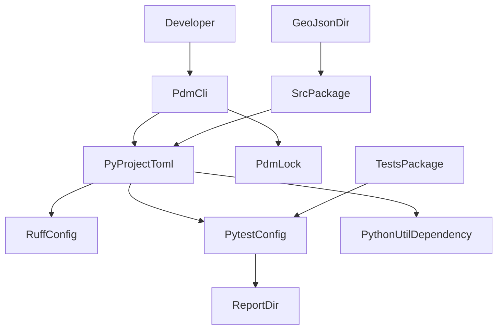

# Design Document

## Overview

**Purpose**: 本featureは、道の駅・SA/PAスクレイピングアプリケーションの開発者に、pdmベースの依存関係管理、ruffによるlint/format、pytestによるテスト実行とHTMLカバレッジレポート出力、標準的な`src`レイアウトのディレクトリ構成という開発基盤一式を提供する。
**Users**: 本プロジェクトの開発者が、`02-common-infra`以降の全specの実装をこの基盤の上に積み上げる。
**Impact**: 現状ソースコードが一切存在しない空のリポジトリに、初めてビルド・lint・テスト可能なPythonプロジェクトの雛形を導入する。

### Goals
- pdmでインストール可能な`pyproject.toml`を用意し、`python_util`をgit依存として解決できるようにする
- ruffによるlint/format基盤(import順序ルールを含む)を整える
- `pdm run pytest`実行時に自動でHTMLカバレッジレポートを`report/`へ出力し、`report/`をgit管理対象外にする
- 以降のspec実装が迷わず配置できる`src`レイアウトのディレクトリ雛形(`src/`, `tests/`, `geo-json/`)を用意する

### Non-Goals
- スクレイピングロジック、GeoJSONスキーマ、ロギング実装そのものの構築(`02-common-infra`〜`06-sapa-scraping`で対応)
- CI/CDパイプラインの構築
- `python_util`が備えるpre-commitフックやテストエビデンスMarkdown自動生成の導入(requirements.mdで要求されていないため対象外)

## Boundary Commitments

### This Spec Owns
- `pyproject.toml`(プロジェクトメタデータ、依存関係、`[tool.ruff]`・`[tool.pytest.ini_options]`設定)
- `pdm.lock`
- `.gitignore`
- `src/roadstop_scraper/`(空パッケージ雛形)、`tests/`、`geo-json/`ディレクトリの雛形
- `README.md`の初期雛形

### Out of Boundary
- ロギング設定の具体的な実装(`02-common-infra`)
- GeoJSON出力スキーマの定義(`03-geojson-schema`)
- HTTP取得・HTMLパースの共通エンジン実装(`04-scraping-engine`)
- 個別サイトスクレイパーの実装(`05-michinoeki-scraping`, `06-sapa-scraping`)

### Allowed Dependencies
- pdm(パッケージ管理ツール、本specが選定・固定する)
- ruff、pytest、pytest-cov(lint/テストツール)
- `python_util`(git依存。本specでは依存追加のみを行い、`get_logger()`等の利用実装は`02-common-infra`以降が担う)

### Revalidation Triggers
- `pyproject.toml`のツール設定(`[tool.ruff]`・`[tool.pytest.ini_options]`)の破壊的変更
- ディレクトリレイアウト(`src`配置、`geo-json/`・`tests/`の場所)の変更
- `python_util`の依存解決方式(バージョン指定・参照先URL)の変更

## Architecture

### Architecture Pattern & Boundary Map

**Selected pattern**: Configuration as Code — 実行時ロジックを持たず、`pyproject.toml`を単一の真実源とした宣言的設定で全ての振る舞い(依存解決・lint・テスト)を表現する(詳細な代替比較は`research.md`のArchitecture Pattern Evaluation参照)。



**Architecture Integration**:
- 選定パターン: Configuration as Code(静的設定ファイルのみでビルド・lint・テストの挙動を規定し、独自スクリプトを持たない)
- ドメイン境界: 依存管理(pdm)、lint(ruff)、テスト/カバレッジ(pytest)、ディレクトリ雛形の4領域に責務を分離
- 既存パターンの踏襲: 姉妹リポジトリ`python_util`の`pyproject.toml`構成(ruffルールセット`E,F,I,UP,B`、`pytest-cov`によるHTMLカバレッジ)を踏襲(`research.md`参照)。ただしカバレッジ出力先は`python_util`の`reports/`ではなく、本プロジェクトのsteeringに合わせ`report/`(単数形)とする
- 新規コンポーネントの理由: `geo-json/`は本プロジェクト固有のスクレイピング結果出力先、`src/roadstop_scraper/`は道の駅・SA/PAスクレイピングロジックの実装先として必要
- Steering準拠: `tech.md`(pdm/ruff/pytest/python_util方針)、`structure.md`(`src`レイアウト、`geo-json/`、`report/`)に準拠

### Technology Stack

| Layer | Choice / Version | Role in Feature | Notes |
|-------|------------------|------------------|-------|
| Package Management | pdm(PEP 621 `pyproject.toml`) | 依存関係解決・仮想環境・ロックファイル管理 | `python_util`と同一ツール |
| Lint / Format | ruff >= 0.15 | 静的解析・import順序(isort相当)の強制 | ルールセット`E,F,I,UP,B`を踏襲(`research.md`) |
| Testing | pytest >= 9.1, pytest-cov >= 7.1 | テスト実行・カバレッジ計測 | HTMLレポートを`report/`に出力(`python_util`の`reports/`とは異なる、`research.md`のDesign Decisions参照) |
| Runtime | Python >= 3.11 | 実行環境 | `python_util`の`requires-python`と合わせる |
| External Dependency | `python_util`(git direct reference) | ログ出力ユーティリティ(利用実装は`02-common-infra`以降) | `pdm add "python_util @ git+https://github.com/t-totsuka/python_util.git"` |
| Build Backend | pdm-backend(`[build-system]` + `[tool.pdm] distribution = true`) | `src/roadstop_scraper`を編集可能インストールし、`import roadstop_scraper`を可能にする | `python_util`と同じビルド設定を踏襲(`research.md`参照) |

## File Structure Plan

### Directory Structure
```
roadstop-scraper/
├── pyproject.toml          # プロジェクトメタデータ、依存関係、ruff/pytest設定を宣言
├── pdm.lock                 # pdmが解決した依存関係のロック(コミット対象)
├── .gitignore                # report/、仮想環境、ツールキャッシュを除外
├── README.md                 # プロジェクト概要の初期雛形
├── src/
│   └── roadstop_scraper/     # アプリケーションソースパッケージ(02以降が中身を実装)
│       └── __init__.py
├── tests/
│   └── __init__.py           # テストパッケージのルート。spec別サブパッケージは後続specが追加
└── geo-json/
    └── .gitkeep               # 空ディレクトリをgit管理下に置くためのプレースホルダ
```

> `report/`は本specでは事前作成せず、`pdm run pytest`実行時にpytest-covが生成し、`.gitignore`により追跡対象外となる。

### Modified Files
なし(新規リポジトリへの初期構築のため、既存ファイルの変更は発生しない)

## Requirements Traceability

| Requirement | Summary | Components | Interfaces | Flows |
|-------------|---------|-------------|------------|-------|
| 1.1–1.5 | pdmプロジェクト初期化・`python_util`git依存・ロック管理 | PyProjectToml, PdmLock | pdm CLI(`install`) | – |
| 2.1–2.3 | ruffによるlint/format設定 | PyProjectToml(`[tool.ruff]`) | ruff CLI(`check`) | – |
| 3.1–3.4 | pytest実行・HTMLカバレッジ・`report/`除外・テスト命名との整合 | PyProjectToml(`[tool.pytest.ini_options]`), TestsPackage, GitIgnore | pytest CLI | – |
| 4.1–4.3 | `src`レイアウト・`tests`分離・`geo-json/`雛形 | SrcPackage, TestsPackage, GeoJsonDir | – | – |
| 5.1–5.2 | `.gitignore`整備・README雛形 | GitIgnore, ReadmeSkeleton | – | – |

## Components and Interfaces

| Component | Domain/Layer | Intent | Req Coverage | Key Dependencies (P0/P1) | Contracts |
|-----------|--------------|--------|---------------|----------------------------|-----------|
| PyProjectToml | Package Management | プロジェクトメタデータ・依存関係・ruff/pytest設定を宣言する | 1.1, 1.2, 1.3, 2.1, 2.3, 3.1 | pdm(P0), ruff(P0), pytest(P0), python_util(P0) | State |
| PdmLock | Package Management | 解決済み依存関係を固定し再現可能なインストールを保証する | 1.4, 1.5 | pdm(P0) | State |
| GitIgnore | Version Control | 生成物・キャッシュ・仮想環境をgit管理対象外にする | 3.3, 5.1 | – | State |
| SrcPackage | Source Layout | 実装コードの配置先(空パッケージ)を提供する | 4.1 | – | State |
| TestsPackage | Test Layout | テストコード配置先とpytest収集の起点を提供する | 3.4, 4.2 | pytest(P0) | State |
| GeoJsonDir | Output Layout | スクレイピング結果の出力先を用意する | 4.3 | – | State |
| ReadmeSkeleton | Documentation | プロジェクト概要の初期雛形を提供する | 5.2 | – | State |

Summary-only コンポーネント(`PdmLock`, `GitIgnore`, `SrcPackage`, `TestsPackage`, `GeoJsonDir`, `ReadmeSkeleton`)は新規の境界を導入しないため、上表のみで表現し個別詳細ブロックは省略する。`PyProjectToml`のみ新規の外部依存境界(`python_util`のgit参照)を導入するため、以下に詳細を示す。

### Package Management

#### PyProjectToml

| Field | Detail |
|-------|--------|
| Intent | pdm/ruff/pytestの挙動を規定する単一の宣言的設定ファイル |
| Requirements | 1.1, 1.2, 1.3, 2.1, 2.3, 3.1 |

**Responsibilities & Constraints**
- プロジェクトメタデータ(名前、`requires-python`)、依存関係(`python_util`含む)、`[tool.ruff]`、`[tool.pytest.ini_options]`を単一ファイルに宣言する
- 本ファイルの記述内容が`pdm install`・`ruff check`・`pytest`全ての挙動を決定する唯一の情報源であり、挙動を分散させない

**Dependencies**
- External: pdm — `pyproject.toml`の解釈・依存解決を行うツール本体(P0)
- External: `python_util`(`git+https://github.com/t-totsuka/python_util.git`)— ログ出力ユーティリティのgit依存(P0)
- External: ruff — lint/format実行ツール(P0)
- External: pytest, pytest-cov — テスト実行・カバレッジ計測ツール(P0)

詳細な参照構文・バージョン固定方針は`research.md`の「pdmによるgit依存関係の追加方法」を参照。

**Contracts**: Service [ ] / API [ ] / Event [ ] / Batch [ ] / State [x]

##### State Management
- State model: `pyproject.toml`のTOMLテキストそのものが唯一の宣言的状態であり、実行時に変化しない
- Persistence & consistency: リポジトリルートに1ファイルのみ存在し、`pdm.lock`と対で整合性を保つ(`pdm install`実行時に不整合があれば`pdm`がエラーを返す)
- Concurrency strategy: 単一開発者による編集を前提とし、同時書き込みの排他制御は設けない

**Implementation Notes**
- Integration: `python_util`セクションは`[tool.ruff]`・`[tool.pytest.ini_options]`と同一ファイル内に共存させ、設定の分散を避ける
- Integration: Python識別子はUnicode文字(漢字・ひらがな)を許容するため、`test_`プレフィックス+アンダースコア区切りを保つ限り、日本語命名規則(3.4)は通常のpytest収集ルールと衝突しない。追加のディレクトリ設定は不要
- Validation: `pdm install`が成功し`pdm.lock`が生成されることをもって設定の妥当性を確認する(専用のバリデーションスクリプトは設けない)
- Risks: `python_util`のデフォルトブランチ変更時の依存解決失敗リスクは`research.md`のRisks & Mitigationsに記録済み

## Error Handling

### Error Strategy
本specはランタイムを持たない設定・雛形であるため、各ツール(pdm/ruff/pytest)標準のエラー出力に委ね、独自のエラーハンドリング機構は設けない。

### Error Categories and Responses
- **依存解決エラー**(`pdm install`が`python_util`のgit参照に到達できない等): pdmの標準エラーメッセージに従い、開発者がネットワーク・認証設定を確認する運用でカバーする
- **設定構文エラー**(`pyproject.toml`のTOML構文誤りや`[tool.ruff]`/`[tool.pytest.ini_options]`の不正値): 各ツールが起動時に検出し、標準エラー出力で報告する

### Monitoring
本specの範囲では監視・ロギングは対象外(ログ出力基盤は`02-common-infra`が担う)。

## Testing Strategy

本specはアプリケーションロジックを持たないため、従来のUnit/Integration/E2Eではなく、基盤設定が機能することを確認するValidation Checksを実施する。

- `pdm install`が正常終了し、`python_util`をgit依存として解決した`pdm.lock`が生成される
- `pdm run ruff check .`が設定エラーなく実行される(空の`src/`ツリーに対して0件の指摘で完了する)
- `pdm run pytest`が実行され、`report/`配下にHTML形式のカバレッジレポート(`report/index.html`)が生成される
- 日本語命名規則(`test_(テスト目的)_(テスト対象)が_(状態)だった場合_(想定される結果)`)に沿ったダミーテストが`pdm run pytest`によって正しく収集・実行されることを確認する
- `git status`実行時に`report/`・仮想環境・ツールキャッシュが未追跡ファイルとして現れない(`.gitignore`が機能している)ことを確認する
