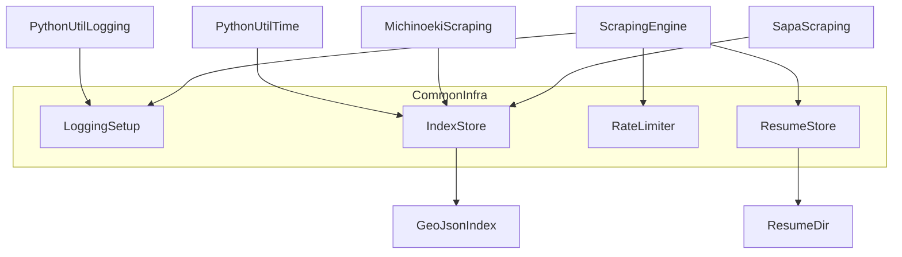
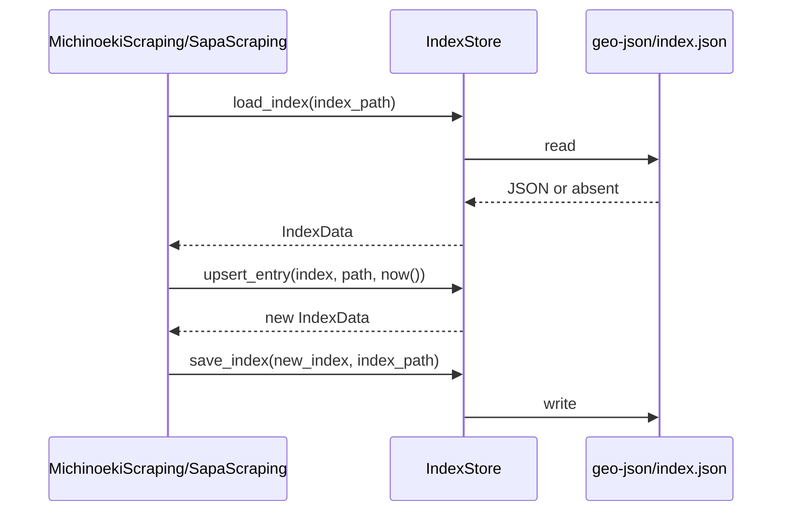
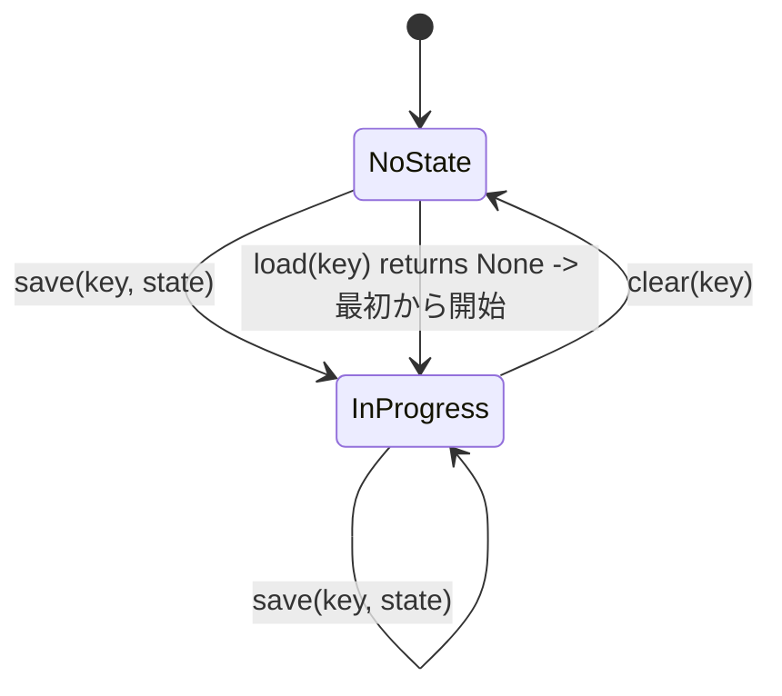

# Design Document

## Overview

**Purpose**: 本featureは、道の駅スクレイピング(`05-michinoeki-scraping`)・SA/PAスクレイピング(`06-sapa-scraping`)の双方に、共通ロギングセットアップ・`geo-json/index.json`管理・リクエスト頻度制御・レジューム(中断・再開)という4つの横断的機能を提供する。
**Users**: `04-scraping-engine`・`05-michinoeki-scraping`・`06-sapa-scraping`の実装者が、本specの提供するモジュールをimportして利用する。
**Impact**: `01-project-scaffolding`が用意した空の`src/roadstop_scraper/`パッケージに、`common/`サブパッケージとして初めて実装コードを追加する。あわせて、レジューム状態の永続化先として`.resume/`ディレクトリを新設する。

### Goals
- `python_util.logging.get_logger()`を用いた共通ロガー取得手段と、定型イベント(開始・終了・失敗)を記録するログヘルパーを提供する
- `geo-json/index.json`の読み込み・エントリ更新・保存を、不正データを検知しつつ一貫した方法で行えるようにする
- 呼び出し側が待機時間を設定変更できるリクエスト頻度制御(レート制限)を提供する
- スクレイピング進捗をキー単位で永続化・復元・クリアできるレジューム機構を提供する

### Non-Goals
- 個別サイトのスクレイピングロジックの実装(`05-michinoeki-scraping`, `06-sapa-scraping`)
- HTTP取得・HTMLパースの共通エンジンそのものの実装(`04-scraping-engine`。本specはそこから利用される横断ロジックのみを提供する)
- GeoJSON本体(Feature/Geometry)のスキーマ定義(`03-geojson-schema`)
- `BaseScraper`等の基底クラスによるフレームワーク化(`research.md`のArchitecture Pattern Evaluation参照。疎結合な独立モジュール群として提供する)
- 複数プロセス・複数スレッドからの並行アクセスに対する排他制御(`research.md`のRisks & Mitigations参照)

## Boundary Commitments

### This Spec Owns
- `src/roadstop_scraper/common/logging_setup.py`(ロガー取得・イベントログヘルパー)
- `src/roadstop_scraper/common/index_store.py`(`geo-json/index.json`の読み込み・更新・保存、および関連データ型・例外)
- `src/roadstop_scraper/common/rate_limiter.py`(リクエスト間隔制御)
- `src/roadstop_scraper/common/resume_store.py`(進捗状態の永続化・復元・クリア)
- `.resume/`ディレクトリ(レジューム状態の永続化先。新規に導入し`.gitignore`へ追加)

### Out of Boundary
- `python_util.logging`の設定読み込み・出力振り分けロジック自体(`python_util`側の既存実装。本specはそれを呼び出すのみ)
- `geo-json/*.geojson`本体の生成・書式(`03-geojson-schema`、`05-michinoeki-scraping`、`06-sapa-scraping`)
- HTTPリクエストの実際の送信処理(`04-scraping-engine`が`RateLimiter`を呼び出す側)
- レジューム状態のデータ構造(処理済みページ・URL一覧等の具体的な形)の定義(`04-scraping-engine`以降が、本specの汎用的な永続化APIを使って定義する)

### Allowed Dependencies
- `python_util.logging`(ロガー取得。P0)
- `python_util.time_utility`(JSTタイムスタンプ生成。P0)
- Python標準ライブラリ(`json`, `pathlib`, `time`, `dataclasses`等)
- `01-project-scaffolding`が確立した`src`レイアウト・pytest/ruff設定

### Revalidation Triggers
- `common/`配下の各モジュールの公開関数・クラスのシグネチャ変更
- `geo-json/index.json`のフォーマット変更(`structure.md`の変更)
- レジューム状態の永続化先(`.resume/`)やキー形式の変更
- `python_util.logging`/`python_util.time_utility`のAPI変更

## Architecture

### Architecture Pattern & Boundary Map

**Selected pattern**: Shared Kernel(共通ライブラリパッケージ)— `common/`配下に相互に独立したモジュールを配置し、下流specが必要なものだけをimportして利用する(代替案比較は`research.md`のArchitecture Pattern Evaluation参照)。



**Architecture Integration**:
- 選定パターン: Shared Kernel — 各モジュールは他の`common`モジュールに依存せず、`python_util`と標準ライブラリのみに依存する(`LoggingSetup`は他モジュールから内部的に利用されない、独立した葉ノード)
- ドメイン境界: ロギング(`LoggingSetup`)、出力ファイル一覧管理(`IndexStore`)、リクエスト制御(`RateLimiter`)、進捗永続化(`ResumeStore`)の4領域に責務を分離
- 既存パターンの踏襲: `01-project-scaffolding`の`src`レイアウトを継承し、`src/roadstop_scraper/common/`として実装コードを初めて配置する
- 新規コンポーネントの理由: `python_util`にはロギング以外の該当機能が存在しないため(`research.md`参照)、`IndexStore`・`RateLimiter`・`ResumeStore`は新規実装する
- Steering準拠: `tech.md`(ログ出力共通化・リクエスト頻度制御・レジューム方針)、`structure.md`(`geo-json/index.json`フォーマット)に準拠

### Technology Stack

| Layer | Choice / Version | Role in Feature | Notes |
|-------|------------------|------------------|-------|
| Runtime | Python >= 3.11(`01-project-scaffolding`で固定済み) | 実行環境 | 追加変更なし |
| Logging | `python_util.logging`(git依存、`01`で導入済み) | ロガー取得・設定反映 | `get_logger(name: str \| None) -> logging.Logger`をそのまま利用(`research.md`参照) |
| Time | `python_util.time_utility` | JSTタイムスタンプ生成 | `now()`が返すaware `datetime`を`index.json`の`updated_at`に使用 |
| Persistence | 標準ライブラリ`json` | `geo-json/index.json`・`.resume/*.json`の読み書き | 外部DB等は導入しない(ファイルベース) |

## File Structure Plan

### Directory Structure
```
src/roadstop_scraper/
└── common/
    ├── __init__.py
    ├── logging_setup.py     # get_loggerの共通公開パス + 開始/終了/失敗イベントログヘルパー
    ├── index_store.py       # geo-json/index.jsonの読み込み・更新・保存、IndexEntry/IndexData、例外
    ├── rate_limiter.py      # RateLimiter(最小リクエスト間隔の待機制御)
    └── resume_store.py      # ResumeStore(進捗状態の永続化・復元・クリア)

tests/common/
├── __init__.py
├── test_logging_setup.py
├── test_index_store.py
├── test_rate_limiter.py
└── test_resume_store.py

.resume/                      # 新規: レジューム状態の永続化先(.gitignoreに追加)
```

### Modified Files
- `.gitignore` — `.resume/`をバージョン管理対象外として追加する

## Requirements Traceability

| Requirement | Summary | Components | Interfaces | Flows |
|-------------|---------|-------------|------------|-------|
| 1.1–1.4 | 共通ロガー取得・設定反映・イベントログヘルパー | LoggingSetup | `get_logger`, `log_scrape_started`, `log_scrape_finished`, `log_scrape_failed` | – |
| 2.1–2.6 | index.jsonの読込・不正検知・更新・保存・タイムスタンプ形式 | IndexStore | `load_index`, `upsert_entry`, `save_index` | index.json更新フロー |
| 3.1–3.3 | 最小待機時間によるリクエスト間隔制御 | RateLimiter | `RateLimiter.wait` | – |
| 4.1–4.4 | 進捗状態の永続化・復元・クリア | ResumeStore | `ResumeStore.save`, `ResumeStore.load`, `ResumeStore.clear` | レジュームライフサイクル |

## Components and Interfaces

| Component | Domain/Layer | Intent | Req Coverage | Key Dependencies (P0/P1) | Contracts |
|-----------|--------------|--------|---------------|----------------------------|-----------|
| LoggingSetup | Logging | 共通ロガー取得とイベントログの定型化 | 1.1, 1.2, 1.3, 1.4 | python_util.logging(P0) | Service |
| IndexStore | Output Management | `geo-json/index.json`の読み書き・更新 | 2.1, 2.2, 2.3, 2.4, 2.5, 2.6 | python_util.time_utility(P0) | Service, State |
| RateLimiter | Request Control | 最小リクエスト間隔の強制 | 3.1, 3.2, 3.3 | – | Service, State |
| ResumeStore | Resume | 進捗状態の永続化・復元・クリア | 4.1, 4.2, 4.3, 4.4 | – | Service, State |

### Logging

#### LoggingSetup

| Field | Detail |
|-------|--------|
| Intent | `python_util.logging.get_logger`への共通importパスを提供し、スクレイピング処理の開始・終了・失敗を定型フォーマットで記録するヘルパーを提供する |
| Requirements | 1.1, 1.2, 1.3, 1.4 |

**Responsibilities & Constraints**
- `get_logger(name: str | None = None) -> logging.Logger`を`python_util.logging`からそのまま再公開する(設定読み込み・フォールバックは`python_util`側の責務、本コンポーネントでは再実装しない)
- 開始・終了・失敗イベントを一貫したメッセージ形式でログに記録する関数を提供し、呼び出し側(`04`〜`06`)がログメッセージ文言をばらつかせないようにする

**Dependencies**
- External: `python_util.logging`(`get_logger`によるロガー取得・設定反映。P0)

**Contracts**: Service [x] / API [ ] / Event [ ] / Batch [ ] / State [ ]

##### Service Interface
```python
def get_logger(name: str | None = None) -> logging.Logger: ...

def log_scrape_started(logger: logging.Logger, target: str) -> None: ...
def log_scrape_finished(logger: logging.Logger, target: str, item_count: int) -> None: ...
def log_scrape_failed(logger: logging.Logger, target: str, error: Exception) -> None: ...
```
- Preconditions: `logger`は`get_logger`で取得済みの`logging.Logger`であること
- Postconditions: 各関数呼び出しごとに1件のログレコードが対応するログレベル(開始/終了は`INFO`、失敗は`ERROR`)で出力される
- Invariants: ログメッセージのフォーマットはtarget名を含み、呼び出し元によらず一貫する

**Implementation Notes**
- Integration: `04-scraping-engine`・`05-michinoeki-scraping`・`06-sapa-scraping`は`get_logger(__name__)`でロガーを取得し、処理の節目で`log_scrape_*`を呼び出す想定
- Validation: `python_util.logging`の設定反映(1.2, 1.3)は`python_util`側で検証済みのため、本コンポーネントでは`get_logger`が再公開時に例外を発生させないことのみを確認する
- Risks: なし(`research.md`のRisks & Mitigations参照)

### Output Management

#### IndexStore

| Field | Detail |
|-------|--------|
| Intent | `geo-json/index.json`のファイル一覧(`path`/`updated_at`)を読み込み・更新・保存する |
| Requirements | 2.1, 2.2, 2.3, 2.4, 2.5, 2.6 |

**Responsibilities & Constraints**
- `geo-json/index.json`を読み込み、不変データ構造`IndexData`として返す
- ファイル不在時は空の`IndexData`を返し、JSON構文が不正な場合・期待する構造(`files`がリストであること、各要素が`path`(string)と`updated_at`(パース可能な日時文字列)を持つこと)を満たさない場合は、いずれも専用例外`IndexFileCorruptedError`に正規化して送出する(既存データを破壊しない)
- 指定`path`のエントリを、存在すれば`updated_at`を更新、存在しなければ新規追加した新しい`IndexData`を返す(既存の`IndexData`は変更しない)
- `IndexData`を`geo-json/index.json`へJSONとして書き込む
- `updated_at`は`python_util.time_utility.now()`で取得したJSTのaware `datetime`を`isoformat()`でシリアライズする(`research.md`のDesign Decisions参照)

**Dependencies**
- External: `python_util.time_utility`(`now()`によるJSTタイムスタンプ生成。P0)

**Contracts**: Service [x] / API [ ] / Event [ ] / Batch [ ] / State [x]

##### Service Interface
```python
@dataclass(frozen=True)
class IndexEntry:
    path: str
    updated_at: datetime

@dataclass(frozen=True)
class IndexData:
    files: tuple[IndexEntry, ...]

class IndexFileCorruptedError(ValueError): ...

def load_index(index_path: Path) -> IndexData: ...
def upsert_entry(index: IndexData, path: str, updated_at: datetime) -> IndexData: ...
def save_index(index: IndexData, index_path: Path) -> None: ...
```
- Preconditions: `index_path`は`geo-json/index.json`を指すパス(呼び出し側が決定する)。`upsert_entry`の`path`は`geo-json/`からの相対パス文字列
- Postconditions: `save_index`実行後、`index_path`のファイル内容は渡された`IndexData`と1:1で対応するJSONになる。`upsert_entry`は入力`IndexData`を変更せず新しいインスタンスを返す
- Invariants: `IndexData.files`内で同一`path`のエントリは常に1件のみ

##### State Management
- State model: `geo-json/index.json`が唯一の永続状態。メモリ上の`IndexData`は不変(immutable)で、更新のたびに新しいインスタンスを生成する
- Persistence & consistency: `load → upsert_entry → save`の呼び出し順序は利用側(`05`/`06`)が制御する。本コンポーネント自体はトランザクション境界を持たない
- Concurrency strategy: 排他制御なし。単一プロセスでの逐次実行を前提とする(`research.md`のRisks & Mitigations参照)

**Implementation Notes**
- Integration: `05-michinoeki-scraping`・`06-sapa-scraping`は、GeoJSONファイルを書き出した直後に`load_index → upsert_entry → save_index`を呼び出してindex.jsonを更新する想定
- Validation: JSON構文エラー・構造不正(いずれも)で`IndexFileCorruptedError`が送出されること、`path`未登録時は新規追加・登録済みなら更新されることを検証する
- Risks: 複数プロセス同時書き込みによる後勝ち上書き(`research.md`のRisks & Mitigations参照)

### Request Control

#### RateLimiter

| Field | Detail |
|-------|--------|
| Intent | 連続するHTTPリクエストの間に、呼び出し側が設定した最小待機時間を強制する |
| Requirements | 3.1, 3.2, 3.3 |

**Responsibilities & Constraints**
- インスタンス生成時に最小待機時間(秒)を受け取り、`wait()`呼び出し時に直前の`wait()`呼び出しからの経過時間が最小待機時間未満であればブロッキング待機する
- 最小待機時間はインスタンスごとに保持され、コンストラクタ引数として呼び出し側が自由に設定できる

**Dependencies**
- なし(標準ライブラリの時刻計測のみ)

**Contracts**: Service [x] / API [ ] / Event [ ] / Batch [ ] / State [x]

##### Service Interface
```python
class RateLimiter:
    def __init__(self, min_interval_seconds: float) -> None: ...
    def wait(self) -> None: ...
```
- Preconditions: `min_interval_seconds >= 0`
- Postconditions: 初回の`wait()`は待機せず即座に返る。2回目以降の`wait()`は、直前の`wait()`完了時刻から`min_interval_seconds`以上経過するまで待機してから返る
- Invariants: 同一インスタンスに対する2回目以降の連続した`wait()`呼び出し間隔は常に`min_interval_seconds`以上(初回呼び出しはこの制約の対象外)

##### State Management
- State model: 直近の`wait()`完了時刻(初期値`None`)をインスタンス内部に保持する。`None`の間(初回呼び出し前)は待機を行わない
- Concurrency strategy: 単一スレッド・単一プロセスでの逐次呼び出しを前提とする

**Implementation Notes**
- Integration: `04-scraping-engine`がHTTPリクエスト送信の直前に`wait()`を呼び出す想定
- Validation: 最小待機時間未満で連続`wait()`した場合に実際の待機が発生すること、最小待機時間を超えて間隔が空いていれば待機しないことを検証する
- Risks: なし

### Resume

#### ResumeStore

| Field | Detail |
|-------|--------|
| Intent | スクレイピング進捗状態をキー単位で永続化・復元・クリアする |
| Requirements | 4.1, 4.2, 4.3, 4.4 |

**Responsibilities & Constraints**
- 呼び出し側が指定するキー(例: `01_hokkaido_michinoeki`)ごとに、進捗状態(JSON化可能な`dict`)を`DEFAULT_STATE_DIR`(既定値`.resume/`)配下の`<key>.json`として永続化する
- 指定キーの永続化状態が存在すればそれを読み込み、存在しなければ`None`を返す(呼び出し側はこれを「最初から開始」の判断に使う)
- 指定キーの永続化状態を削除する(正常完了時に呼び出される想定)

**Dependencies**
- なし(標準ライブラリの`json`/`pathlib`のみ)

**Contracts**: Service [x] / API [ ] / Event [ ] / Batch [ ] / State [x]

##### Service Interface
```python
DEFAULT_STATE_DIR: Path = Path(".resume")

class ResumeStore:
    def __init__(self, state_dir: Path = DEFAULT_STATE_DIR) -> None: ...
    def save(self, key: str, state: dict[str, Any]) -> None: ...
    def load(self, key: str) -> dict[str, Any] | None: ...
    def clear(self, key: str) -> None: ...
```
- Preconditions: `state`はJSONシリアライズ可能な`dict`であること
- Postconditions: `save`後、同一キーで`load`すると保存した内容と等価な`dict`が返る。`clear`後、同一キーで`load`すると`None`が返る
- Invariants: キーごとの状態は互いに独立しており、あるキーへの操作が他のキーの状態に影響しない。`state_dir`を明示指定しない限り、常に`.resume/`が使用される(本specが所有する規約上の唯一の既定パス)

##### State Management
- State model: `.resume/<key>.json`がキー単位の唯一の永続状態(`research.md`のDesign Decisions参照)
- Persistence & consistency: `save`は対象ファイルの全体を都度上書きする。部分更新は呼び出し側が`load`した`dict`を変更して`save`し直すことで行う
- Concurrency strategy: 排他制御なし。単一プロセスでの逐次実行を前提とする(`research.md`のRisks & Mitigations参照)

**Implementation Notes**
- Integration: `04-scraping-engine`・`05`・`06`は、対象(都道府県・サイト等)ごとに一意なキーを決定し、進捗更新のたびに`save`、再実行時に`load`、正常完了時に`clear`を呼び出す想定
- Validation: `save`→`load`の往復で内容が一致すること、未保存キーの`load`が`None`を返すこと、`clear`後に`load`が`None`を返すことを検証する
- Risks: `.resume/`配下にクリアされないファイルが残留し続けるとディスクを消費する(異常終了時の後始末は呼び出し側の運用に委ねる)

## Data Models

### Logical Data Model

**`geo-json/index.json`**(`IndexData`)
- `files`: `IndexEntry`の配列
  - `path`: string — `geo-json/`からの相対パス(例: `01_hokkaido_michinoeki.geojson`)。一覧内で一意
  - `updated_at`: string(ISO 8601, JSTオフセット付き)— 最終更新日時

**`.resume/<key>.json`**
- キー(ファイル名)ごとに任意のJSONオブジェクト(呼び出し側が定義する進捗状態。本specはスキーマを規定しない)

## System Flows

### index.json更新フロー


### レジュームライフサイクル


## Error Handling

### Error Strategy
ファイルI/O・JSON解析に起因するエラーは、呼び出し側が判別・対処できるよう専用の例外型で表面化させる。`RateLimiter`・`ResumeStore.save/clear`は正常系のみを扱い、独自例外は導入しない。

### Error Categories and Responses
- **index.json破損**(`IndexStore.load_index`がJSON構文エラー、または`files`がリストでない・エントリに`path`/`updated_at`が欠落しているなどの構造不正を検出): いずれの場合も`IndexFileCorruptedError`(`ValueError`のサブクラス、`python_util`の例外設計方針を踏襲)に正規化して送出し、呼び出し側に破損データの手動確認を促す。個別の`KeyError`/`TypeError`等を呼び出し側へ露出させない
- **レジューム状態の読み込み失敗**(`.resume/<key>.json`が存在しない): エラーではなく`None`を返し、「最初から開始」として扱う(4.3)
- **不正なレート制限値**(`min_interval_seconds < 0`): `ValueError`を送出し、設定ミスを早期に検知する

### Monitoring
本spec自体は監視機構を持たない。`LoggingSetup`が提供するイベントログヘルパーを通じて、開始・終了・失敗が記録されることで、下流spec側の運用監視を可能にする。

## Testing Strategy

### Unit Tests
- `LoggingSetup`: `get_logger`が`logging.Logger`を返すこと、`log_scrape_started`/`log_scrape_finished`/`log_scrape_failed`がそれぞれ想定ログレベルでメッセージを記録すること
- `IndexStore`: ファイル不在時に空`IndexData`を返すこと、JSON構文エラー・構造不正(`files`が非リスト、`path`/`updated_at`欠落)のいずれでも`IndexFileCorruptedError`を送出すること、新規`path`の追加と既存`path`の更新が正しく行われること、`save_index`後の再読み込みで内容が一致すること(往復検証)
- `RateLimiter`: 初回`wait()`は待機せず即座に返ること、2回目以降で最小待機時間未満での連続`wait()`が待機を発生させること、最小待機時間経過後は待機しないこと
- `ResumeStore`: `save`→`load`の往復一致、未保存キーで`None`が返ること、`clear`後に`None`が返ること

### Integration Tests
- `IndexStore`の`load_index → upsert_entry → save_index`の一連の流れを、一時ディレクトリ上の実ファイルに対して実行し、`geo-json/index.json`と同一フォーマットのJSONが生成されることを確認する
- `LoggingSetup`経由で取得したロガーが、`pyproject.toml`の`[tool.python_util.logging]`設定(未設定時のデフォルト動作を含む)に従って出力されることを確認する
