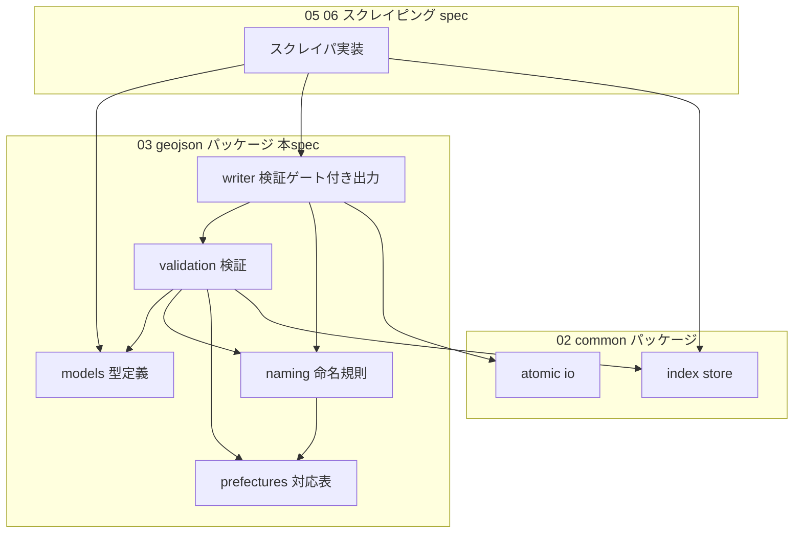
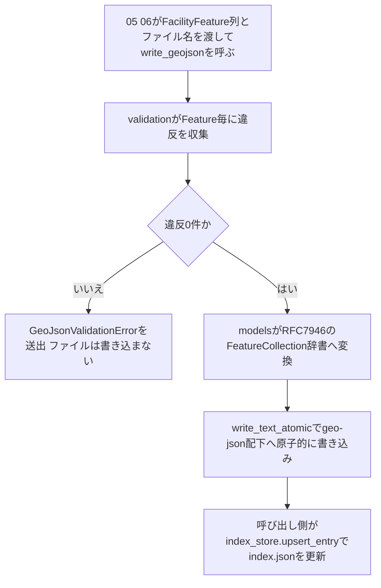

# Technical Design Document

## Overview

**Purpose**: 本機能は、道の駅・SA/PA双方のスクレイピング結果が共通で従うGeoJSON出力スキーマ(FeatureCollection構造・プロパティ項目・座標系・ファイル命名規則)と、出力前バリデーション・`index.json`整合性検証の実装を、後続spec(`05-michinoeki-scraping`・`06-sapa-scraping`)へ提供する。

**Users**: 05/06のスクレイピング実装者が、収集データを型付きモデルへ詰め、検証ゲート付きライタで`geo-json/`配下へ出力するために利用する。最終的には道の駅アプリ等の消費側が、施設種別を問わず単一スキーマのGeoJSONを受け取る。

**Impact**: 新規パッケージ`src/roadstop_scraper/geojson/`を追加する。既存の`common/`(02-common-infra)は変更せず、アトミック書き込みと`IndexData`型を利用する。

### Goals

- 道の駅・SA/PAで共通のGeoJSON Feature構造と`properties`項目を型として定義する(RFC 7946準拠・WGS84)
- `(都道府県番号2桁)_(都道府県名ローマ字)_(michinoeki|sapa).geojson`命名規則の生成・検証手段と47都道府県対応表を提供する
- スキーマ違反データが`geo-json/`配下へ永続化されない構造(検証ゲート付きライタ)を提供する
- `index.json`のエントリが命名規則と整合することを検証する手段を提供する

### Non-Goals

- 対象サイトからのデータ収集・HTMLパース(04/05/06の責務)
- `index.json`自体の読み書き・更新(`common/index_store`で整備済み)
- ファイル名とFeature内容(都道府県・種別)の整合検証。ファイル名はあくまで分割の単位であり、名前自体に内容の契約を持たせない(将来ファイルが肥大化した際の再分割等の拡張性を優先する。research.md「設計レビューでの決定」参照)
- NEXCO東日本管内の座標欠落への代替取得手段(ジオコーディング等。06で検討)
- 施設設備タグ文字列の語彙正規化(将来課題。research.md参照)

## Boundary Commitments

### This Spec Owns

- GeoJSON Featureのデータモデル(必須/任意項目・型・列挙値)の定義と、その唯一の正となる型
- 出力ファイル命名規則の生成・解析・検証ロジックと都道府県コード対応表
- 出力前バリデーション(違反の収集・報告・出力中断)と、`geo-json/`配下へのGeoJSONファイル書き込み経路
- `index.json`エントリの命名規則整合性の検証ルール

### Out of Boundary

- `index.json`の読み込み・upsert・保存(`common/index_store`が所有。本specは検証のみ)
- スクレイピング結果からモデルへの値の抽出・変換(05/06が所有)
- レート制限・レジューム・ロギングの各機構(02で整備済み)

### Allowed Dependencies

- `roadstop_scraper.common._atomic_io.write_text_atomic` — アトミック書き込みの再利用
- `roadstop_scraper.common.index_store.IndexData` / `IndexEntry` — index整合性検証の入力型
- Python標準ライブラリのみ(新規サードパーティ依存の追加は不可。research.md「Architecture Pattern Evaluation」参照)
- 依存方向の制約: `geojson/` → `common/` の一方向のみ。`common/`から`geojson/`を参照してはならない

### Revalidation Triggers

- `FacilityProperties`の必須項目・列挙値・JSONキー名の変更(05/06と消費側アプリに影響)
- ファイル命名規則パターンの変更(02の`index.json`運用と05/06の出力先に影響)
- `write_geojson()`のシグネチャ・例外契約の変更(05/06の出力フローに影響)
- `common/index_store`のデータ型変更(本specの整合性検証の入力が変わる)

## Architecture

### Existing Architecture Analysis

`02-common-infra`で確立されたパターンに従う(research.md「既存コードベースのパターン調査」参照):

- 不変データは`@dataclass(frozen=True)`、更新は新インスタンス生成
- APIはモジュールレベル関数+`__all__`、エラーは`ValueError`サブクラスの独自例外
- ファイル書き込みは`write_text_atomic`による原子的置き換え
- バリデーションは手書きの型チェック(pydantic等は導入しない)

### Architecture Pattern & Boundary Map



**Architecture Integration**:

- Selected pattern: 型定義を核とした層状モジュール構成。依存方向は `prefectures → models → naming → validation → writer` の一方向(左のモジュールは右を参照しない)
- Domain/feature boundaries: スキーマの「定義と強制」のみを本specが所有し、値の生成(05/06)と一覧管理(02)は外部に置く
- Existing patterns preserved: frozen dataclass、モジュール関数API、独自例外、アトミック書き込み
- New components rationale: 検証(validation)と出力(writer)を分離するのは、05/06が書き込みなしのドライラン検証を行えるようにするため。writerは検証を内包し、未検証データの書き込み経路を存在させない
- Steering compliance: 外部依存はpython_utilのみという`tech.md`の方針を維持(本specは標準ライブラリのみ使用)

### Technology Stack

| Layer | Choice / Version | Role in Feature | Notes |
|-------|------------------|-----------------|-------|
| Data / Storage | Python 3.11 標準ライブラリ (dataclasses, json, re, enum) | 型定義・検証・シリアライズ | 新規依存なし。選定理由はresearch.md参照 |
| Data / Storage | `common._atomic_io` (既存) | GeoJSONファイルの原子的書き込み | 02-common-infraを再利用 |
| Backend / Services | `python_util.logging` (既存) | 検証エラー・出力結果のログ記録 | steering `tech.md`のログ方針に従う |

## File Structure Plan

### Directory Structure

```text
src/roadstop_scraper/geojson/
├── __init__.py        # 公開APIの再エクスポート(利用側はこのモジュールだけをimportする)
├── prefectures.py     # 都道府県コード・ローマ字名の対応表と参照関数
├── models.py          # Feature/properties/座標の型定義とGeoJSON辞書への変換
├── naming.py          # 出力ファイル名の生成・検証
├── validation.py      # スキーマ検証・index.json整合性検証(違反の収集)
└── writer.py          # 検証ゲート付きGeoJSON出力

tests/geojson/
├── __init__.py
├── test_prefectures.py
├── test_models.py
├── test_naming.py
├── test_validation.py
└── test_writer.py     # write_text_atomic連携の統合観点を含む
```

### Modified Files

- なし(既存ファイルへの変更は発生しない。`common/`は参照のみ)

## System Flows

出力要求から永続化までの検証ゲートの流れ:



- 検証は全Featureを走査してから結果を返す(最初の違反で打ち切らない)。5.2の「対象Featureと違反項目の特定」を1回の実行で網羅的に報告するため
- index.jsonの更新(G)は本specの境界外。ただし書き込み成功後にのみ呼ぶ順序契約を05/06のtasksで明示する

## Requirements Traceability

| Requirement | Summary | Components | Interfaces | Flows |
|-------------|---------|------------|------------|-------|
| 1.1–1.4 | FeatureCollection構造(RFC 7946・Point・共通構造) | models | `FacilityFeature`, `to_feature_collection_dict` | 出力フロー E |
| 2.1–2.9 | properties項目(必須/共通任意/種別固有/省略許容) | models, validation | `FacilityProperties` | — |
| 3.1–3.3 | WGS84・[経度,緯度]順・値域 | models, validation | `Coordinate`, `validate_features` | — |
| 4.1–4.5 | ファイル命名規則・出力先 | naming | `build_geojson_filename`, `parse_geojson_filename` | — |
| 4.6 | 47都道府県対応表 | prefectures | `PREFECTURES`, `find_prefecture` | — |
| 5.1–5.6 | 出力前検証・違反報告・出力中断 | validation, writer | `validate_features`, `write_geojson` | 出力フロー B–F |
| 6.1–6.4 | index.jsonスキーマ整合性 | validation | `validate_index_consistency` | — |

## Components and Interfaces

| Component | Domain/Layer | Intent | Req Coverage | Key Dependencies (P0/P1) | Contracts |
|-----------|--------------|--------|--------------|--------------------------|-----------|
| prefectures | 参照データ | 都道府県コード対応表の提供 | 4.2, 4.3, 4.6 | なし | Service |
| models | ドメイン型 | Feature/propertiesの型定義とGeoJSON辞書変換 | 1.1–1.4, 2.1–2.9, 3.1, 3.2 | prefectures (P1) | Service |
| naming | ドメインロジック | ファイル名の生成・解析・検証 | 4.1–4.5 | prefectures (P0) | Service |
| validation | ドメインロジック | スキーマ検証・index整合性検証 | 2.1, 2.3, 3.3, 5.1–5.4, 6.1–6.4 | models (P0), naming (P0), index_store (P1) | Service |
| writer | 出力ゲートウェイ | 検証合格時のみの原子的書き込み | 5.1, 5.5, 5.6 | validation (P0), _atomic_io (P0) | Service, Batch |

### 参照データ層

#### prefectures

| Field | Detail |
|-------|--------|
| Intent | 47都道府県の番号(01〜47)・ローマ字名・日本語名の対応表と参照関数を提供する |
| Requirements | 4.2, 4.3, 4.6 |

**Responsibilities & Constraints**

- 全国地方公共団体コード準拠のゼロ埋め2桁コードと小文字ローマ字名(例: `01`/`hokkaido`)、日本語名(例: `北海道`)を不変の定数として保持する
- 対応表は本モジュールが唯一の正。他モジュールでの重複定義を禁止する

**Dependencies**

- Inbound: models, naming, validation — コード・名称の解決 (P0)
- Outbound / External: なし

**Contracts**: Service [x]

##### Service Interface

```python
@dataclass(frozen=True)
class Prefecture:
    code: str       # "01"〜"47"(ゼロ埋め2桁)
    romaji: str     # 小文字ローマ字(例: "hokkaido")
    name_ja: str    # 日本語名(例: "北海道")

PREFECTURES: tuple[Prefecture, ...]  # 47件、コード昇順

def find_prefecture(code: str) -> Prefecture:
    """コードに対応するPrefectureを返す。未知のコードはUnknownPrefectureErrorを送出する。"""
```

- Preconditions: なし(定数参照)
- Postconditions: `PREFECTURES`は常に47件・重複コードなし
- Invariants: 定義後の変更不可(タプル+frozen dataclass)

### ドメイン型層

#### models

| Field | Detail |
|-------|--------|
| Intent | 施設1件を表す型(座標・properties)と、Feature列からRFC 7946準拠のFeatureCollection辞書への変換を提供する |
| Requirements | 1.1, 1.2, 1.3, 1.4, 2.1–2.9, 3.1, 3.2 |

**Responsibilities & Constraints**

- 道の駅・SA/PAで単一の`FacilityProperties`型を共有する(1.4)。種別固有項目は任意フィールドとして同居させる
- 型としての構造保証(フィールドの存在・型)まで を担い、値の妥当性検証(空文字・値域・整合)はvalidationの責務
- GeoJSON辞書変換では`None`の任意項目をキーごと省略する(2.9)。座標は`[経度, 緯度]`順で出力する(3.2)

**Dependencies**

- Inbound: validation, writer, 05/06スクレイパ — データの生成と受け渡し (P0)
- Outbound: prefectures — 都道府県コードの型的参照 (P1)

**Contracts**: Service [x]

##### Service Interface

```python
class FacilityKind(StrEnum):
    MICHINOEKI = "michinoeki"
    SAPA = "sapa"

class Direction(StrEnum):
    """SA/PAの上り/下り区分。JSON出力値は日本語2値に正規化する。"""
    UP = "上り"
    DOWN = "下り"

@dataclass(frozen=True)
class Coordinate:
    longitude: float  # 経度(WGS84)
    latitude: float   # 緯度(WGS84)

@dataclass(frozen=True)
class Parking:
    large: int | None = None      # 大型
    standard: int | None = None   # 普通車
    disabled: int | None = None   # 身障者用

@dataclass(frozen=True)
class FacilityProperties:
    name: str                                  # 必須: 施設名称 (2.1)
    kind: FacilityKind                         # 必須: 施設種別 (2.3)
    pref_code: str                             # 都道府県番号 (2.4)
    pref_name: str                             # 都道府県名 (2.4)
    address: str | None = None                 # 住所(郵便番号含む) (2.2)
    postal_code: str | None = None             # 郵便番号 (2.2)
    tel: str | None = None                     # 電話番号 (2.5)
    opening_hours: str | None = None           # 営業時間(自由記述) (2.5)
    parking: Parking | None = None             # 駐車場台数 (2.5)
    websites: tuple[str, ...] = ()             # 施設ホームページURL(道の駅は最大2件) (2.5)
    source_url: str | None = None              # 情報源URL (2.5)
    facilities: tuple[str, ...] = ()           # 施設設備・サービスのタグ列 (2.6)
    road_name: str | None = None               # SA/PA固有: 路線名 (2.7)
    direction: Direction | None = None         # SA/PA固有: 上り/下り (2.7)
    area_direction: str | None = None          # SA/PA固有: 方面 (2.7)
    mapcode: str | None = None                 # 道の駅固有: マップコード (2.8)

@dataclass(frozen=True)
class FacilityFeature:
    coordinate: Coordinate
    properties: FacilityProperties

def to_feature_collection_dict(features: Sequence[FacilityFeature]) -> dict[str, object]:
    """RFC 7946準拠のFeatureCollection辞書へ変換する。Noneの任意項目はキーを省略する。"""
```

- Preconditions: なし(検証前のデータも保持できる)
- Postconditions: 変換結果は`{"type": "FeatureCollection", "features": [...]}`、各Featureは`{"type": "Feature", "geometry": {"type": "Point", "coordinates": [lon, lat]}, "properties": {...}}`
- Invariants: RFC 7946に従い`crs`メンバは出力しない(WGS84が規定値のため)

**Implementation Notes**

- Integration: properties辞書のJSONキーはdataclassフィールド名と同一のsnake_case英語キーとする(消費側アプリとの契約)
- Integration: 情報源の生の表記(「up」「上り線」等)から`Direction`への正規化は05/06のマッピング責務。本specは正規化後の日本語2値のみを受理する
- Validation: 型レベルの保証のみ。値検証はvalidationモジュールへ委譲
- Risks: 施設設備タグの語彙はソース依存(research.md参照)。キー名変更は消費側破壊変更となるためRevalidation Triggersに従う

### ドメインロジック層

#### naming

| Field | Detail |
|-------|--------|
| Intent | 出力ファイル名の生成・解析・検証を一元化する |
| Requirements | 4.1, 4.2, 4.3, 4.4, 4.5 |

**Responsibilities & Constraints**

- ファイル名パターン `^(0[1-9]|[1-3][0-9]|4[0-7])_[a-z]+_(michinoeki|sapa)\.geojson$` の唯一の定義箇所
- 出力先ディレクトリ`geo-json/`の既定値を保持する(4.5)

**Dependencies**

- Inbound: validation, writer, 05/06スクレイパ (P0)
- Outbound: prefectures — コードとローマ字名の整合確認 (P0)

**Contracts**: Service [x]

##### Service Interface

```python
def build_geojson_filename(prefecture: Prefecture, kind: FacilityKind) -> str:
    """命名規則に適合するファイル名(例: "01_hokkaido_michinoeki.geojson")を生成する。"""

def parse_geojson_filename(filename: str) -> tuple[Prefecture, FacilityKind]:
    """ファイル名を解析して構成要素を返す。規則違反・未知の都道府県はInvalidGeoJsonFilenameErrorを送出する。"""
```

- Preconditions: `parse`の入力はパス区切りを含まないファイル名単体
- Postconditions: `parse(build(p, k)) == (p, k)`(往復一致)。ローマ字名が対応表と一致しないコードは違反として扱う
- Invariants: 生成されるファイル名は常に正規表現パターンに適合する

#### validation

| Field | Detail |
|-------|--------|
| Intent | Feature列・ファイル名・index.jsonエントリのスキーマ違反を網羅的に収集して報告する |
| Requirements | 2.1, 2.3, 3.3, 5.1, 5.2, 5.3, 5.4, 6.1, 6.2, 6.3, 6.4 |

**Responsibilities & Constraints**

- 検証は違反を発見しても打ち切らず、全Feature・全項目を走査して`ValidationIssue`のリストを返す(5.2の網羅的報告)
- 検証ルール: 必須文字列の非空(name, pref_name)、`kind`・`direction`の列挙値、`pref_code`の実在と`pref_name`との整合、緯度±90/経度±180の値域(3.3)、ファイル名の命名規則適合(5.4)、index.jsonの`path`の命名規則適合(6.2, 6.4)
- ファイル名とFeature内容(都道府県・種別)の整合は検証しない(Non-Goals参照。ファイル名は分割の単位であり、都道府県・種別の正は`properties`側にある)
- 例外を投げるかどうかは呼び出し側(writer)が決める。本モジュールは報告のみ

**Dependencies**

- Inbound: writer, 05/06スクレイパ(ドライラン検証) (P0)
- Outbound: models, naming, prefectures (P0) / `common.index_store.IndexData` — 整合性検証の入力型 (P1)

**Contracts**: Service [x]

##### Service Interface

```python
@dataclass(frozen=True)
class ValidationIssue:
    location: str    # 違反箇所(例: "features[3].properties.name", "filename", "index.files[2].path")
    message: str     # 違反理由(日本語)

def validate_features(features: Sequence[FacilityFeature]) -> list[ValidationIssue]:
    """Feature列のスキーマ適合性を検証し、違反を全件返す。適合時は空リスト。"""

def validate_filename(filename: str) -> list[ValidationIssue]:
    """ファイル名の命名規則適合性を検証する。"""

def validate_index_consistency(index: IndexData) -> list[ValidationIssue]:
    """index.jsonの各エントリのpathが命名規則に適合するかを検証する。(6.1, 6.2, 6.4)"""
```

- Preconditions: 入力は型として構築済みであること(型エラーはこの層より前で失敗する)
- Postconditions: 戻り値が空リストであることと「スキーマ適合」が同値
- Invariants: 検証は入力を変更しない(副作用なし)

**Implementation Notes**

- Integration: `updated_at`のISO 8601形式(6.3)は`index_store`の`datetime`型が既に保証しているため、本specでは`path`の検証のみを追加する
- Validation: 座標の`NaN`/`inf`は値域違反として扱う(3.3の「解釈できない形式」)
- Risks: 検証ルールとrequirements.mdの乖離。traceabilityの要件IDをテスト名に対応付けて防ぐ

### 出力ゲートウェイ層

#### writer

| Field | Detail |
|-------|--------|
| Intent | 検証合格時のみGeoJSONファイルを原子的に書き込む唯一の出力経路を提供する |
| Requirements | 5.1, 5.5, 5.6 |

**Responsibilities & Constraints**

- 書き込み前に必ず`validate_features`+`validate_filename`を実行し、違反が1件でもあれば書き込まずに例外を送出する(5.5)
- 書き込みは`write_text_atomic`で行い、部分書き込みでの破損ファイルを残さない
- 検証エラー・出力完了は`python_util.logging`のロガーで記録する

**Dependencies**

- Inbound: 05/06スクレイパ (P0)
- Outbound: validation (P0), models (P0), `common._atomic_io.write_text_atomic` (P0), `python_util.logging` (P1)

**Contracts**: Service [x] / Batch [x]

##### Service Interface

```python
class GeoJsonValidationError(ValueError):
    """出力前検証で違反が検出された場合に送出される。issuesに全違反を保持する。"""
    issues: tuple[ValidationIssue, ...]

def write_geojson(
    features: Sequence[FacilityFeature],
    filename: str,
    output_dir: Path = Path("geo-json"),
) -> Path:
    """検証合格時のみFeatureCollectionをJSONとして書き込み、出力先パスを返す。"""
```

- Preconditions: `output_dir`は存在しなくてよい(必要時に作成)
- Postconditions: 戻り値のパスに検証済みGeoJSONが存在する。例外時はファイルシステムに変更を残さない
- Invariants: 未検証データがこの関数経由で書き込まれることはない

##### Batch / Job Contract

- Trigger: 05/06スクレイパが都道府県×施設種別の単位で呼び出す
- Input / validation: `FacilityFeature`列+ファイル名。前掲の全検証ルールを適用
- Output / destination: `geo-json/{filename}`(UTF-8・`ensure_ascii=False`・末尾改行。`index_store`の出力体裁と揃える)
- Idempotency & recovery: 同一入力での再実行は同一内容の上書きとなり冪等。書き込み失敗時は既存ファイルが保全される(`write_text_atomic`の保証)

## Data Models

### Domain Model

- 集約: `FacilityFeature`(施設1件)。`Coordinate`と`FacilityProperties`は値オブジェクトとして集約に内包される
- 不変条件: 施設名称・施設種別・座標なしの施設は出力データとして存在できない(検証ゲートで強制)
- `Prefecture`は共有参照データ(値オブジェクト)であり、集約間で同一インスタンスを参照してよい

### Data Contracts & Integration

出力GeoJSONの`properties`スキーマ(JSONキーはフィールド名と同一):

| JSONキー | 型 | 必須 | 対応要件 |
|----------|----|------|----------|
| name | string | ○ | 2.1 |
| kind | "michinoeki" \| "sapa" | ○ | 2.3 |
| pref_code | string ("01"〜"47") | ○ | 2.4 |
| pref_name | string | ○ | 2.4 |
| address / postal_code / tel / opening_hours | string | — | 2.2, 2.5 |
| parking | object {large, standard, disabled: number} | — | 2.5 |
| websites | string[] | — | 2.5 |
| source_url | string | — | 2.5 |
| facilities | string[] | — | 2.6 |
| road_name / area_direction | string | — | 2.7 |
| direction | "上り" \| "下り" | — | 2.7 |
| mapcode | string | — | 2.8 |

- 任意項目は値が無い場合キーごと省略する(2.9)。`null`は受理するが出力では省略に正規化する
- スキーマ進化: キーの追加は後方互換、キーの変更・削除・必須化はRevalidation Triggers対象

## Error Handling

### Error Strategy

- 例外は既存パターンに合わせ`ValueError`サブクラスで表現する: `UnknownPrefectureError`(prefectures)、`InvalidGeoJsonFilenameError`(naming)、`GeoJsonValidationError`(writer)
- 検証層(validation)は例外ではなく`list[ValidationIssue]`を返す。「報告の網羅性」と「中断の判断」を分離し、ドライラン検証を可能にするため
- `GeoJsonValidationError`は全違反(`issues`)を保持し、メッセージに件数と先頭数件の要約を含める(利用者が一度の実行で全問題を把握できるようにする)

### Error Categories and Responses

- **入力データ不正**(必須項目欠落・座標範囲外・列挙値違反): 検証で全件収集 → `GeoJsonValidationError` → 出力中断・ファイル無変更(5.5)
- **ファイル名不正**: 同上(5.4)。`build_geojson_filename`を使う限り発生しない設計
- **I/O失敗**(ディスク・権限): `write_text_atomic`が例外を再送出し、既存ファイルは保全される。リトライは呼び出し側の判断

### Monitoring

- writerが検証違反(WARNING、違反件数と要約)・出力完了(INFO、パスとFeature件数)を`python_util.logging`で記録する。設定は`pyproject.toml`の`[tool.python_util.logging]`に従う(steering `tech.md`)

## Testing Strategy

テスト関数名はsteeringの日本語命名規則 `test_(テスト目的)_(テスト対象)が_(状態)だった場合_(想定される結果)` に従う。

### Unit Tests

- prefectures: 対応表が47件・コード昇順・重複なしであること。未知コードで`UnknownPrefectureError`となること(4.6)
- naming: 生成と解析の往復一致。コード範囲外(`00`/`48`)・大文字・不正種別の拒否(4.1–4.4)
- models: `to_feature_collection_dict`がRFC 7946構造・[経度,緯度]順で出力し、`None`項目のキーを省略すること(1.1–1.4, 2.9, 3.2)
- validation: 必須項目欠落・座標範囲外・`NaN`・種別/都道府県不整合の各違反が`location`付きで全件報告されること(2.1, 2.3, 3.3, 5.2, 5.3)
- validation: `validate_index_consistency`が命名規則違反の`path`を検出すること(6.2, 6.4)

### Integration Tests

- writer: 違反ありデータで`GeoJsonValidationError`となり、出力先にファイルが作成されないこと(5.5)
- writer: 適合データで`geo-json/`配下にファイルが作成され、JSONとして再読込した内容がスキーマに一致すること(5.6)
- writer→index_store: 出力したファイル名を`upsert_entry`で登録した`IndexData`が`validate_index_consistency`を通過すること(6.1–6.3)

### E2E/UI Tests

- 該当なし(ライブラリ機能のみでUIを持たない)
