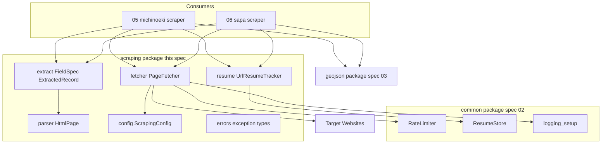
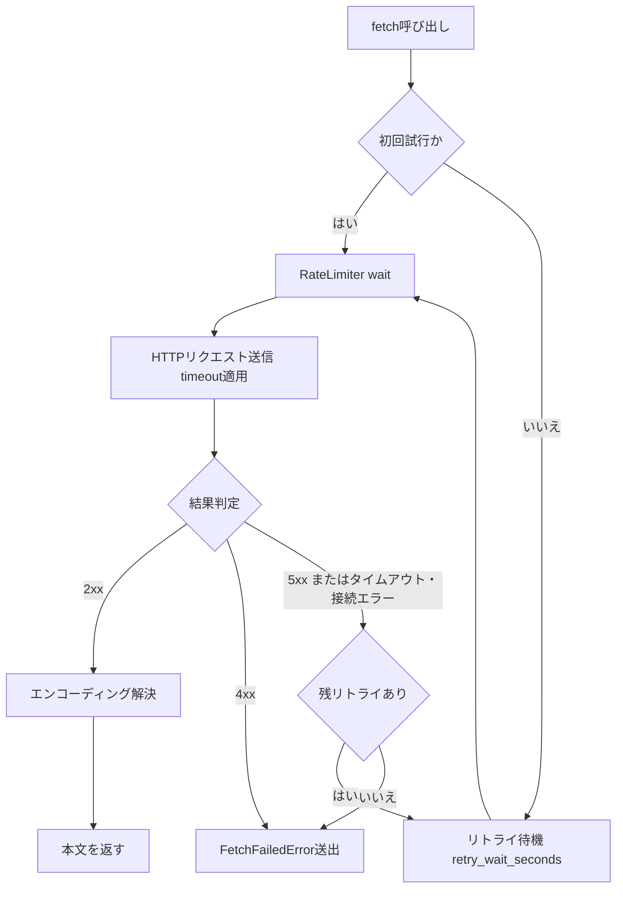

# Technical Design Document

## Overview

**Purpose**: 本機能は、道の駅スクレイピング(`05-michinoeki-scraping`)・SA/PAスクレイピング(`06-sapa-scraping`)の開発者に対して、HTTP取得・HTMLパースの共通エンジンを提供する。各スクレイパはHTTPアクセス・リトライ・パース・構造変化検知を個別実装せず、サイト固有のURL構成と抽出ルール(CSSセレクタ)の記述に集中できる。

**Users**: 05/06のスクレイパ実装が、ページ取得(`PageFetcher`)・要素抽出(`HtmlPage`・`FieldSpec`)・処理済みURL管理(`UrlResumeTracker`)の部品として利用する。

**Impact**: 新規パッケージ`src/roadstop_scraper/scraping/`を追加する。既存コード(`common/`・`geojson/`)は変更せず、外部依存としてrequests・beautifulsoup4を新規導入する。

### Goals

- URL指定でHTML・JSONを取得する共通手段の提供(レート制限適用・エンコーディング解決込み)
- タイムアウト・リトライの自動処理と、`pyproject.toml`による設定外部化
- パースライブラリを隠蔽した要素抽出APIと、HTML構造変化の構造的な検知
- `02-common-infra`(レート制限・レジューム・ロギング)とのシームレスな連携
- `03-geojson-schema`のFeature構築にマッピング可能な、汎用の構造化レコードの受け渡し

### Non-Goals

- 個別サイトのURL構成・抽出ルール・`FacilityProperties`へのマッピング(05/06の責務)
- GeoJSONの検証・ファイル出力(03の`write_geojson`が唯一の出力経路)
- 並行・非同期クロール(レート制限による逐次実行が前提。`RateLimiter`・`ResumeStore`の単一プロセス前提を引き継ぐ)
- 座標を取得できない情報源への代替手段(ジオコーディング等。06で検討)
- `BaseScraper`のようなフレームワーク化(02のresearch.mdで不採用決定済み。コンポジションで提供する)

## Boundary Commitments

### This Spec Owns

- HTTP取得の実行制御: レート制限適用・タイムアウト・リトライ・エラーステータスの扱い
- 取得設定の定義と読み込み: `[tool.roadstop_scraper.scraping]`テーブルの契約
- パース抽象化: `HtmlPage`のセレクタベース抽出APIと、bs4の隠蔽
- 構造変化検知の例外契約: `StructureChangedError`の形と送出条件
- 抽出結果の汎用受け渡し形式: `FieldSpec`・`ExtractedRecord`
- URL単位のレジューム利用手順: `UrlResumeTracker`

### Out of Boundary

- サイト固有の知識すべて(URL一覧の組み立て、セレクタの値、値の正規化、`Direction`等へのマッピング)
- `RateLimiter`・`ResumeStore`・`logging_setup`の内部実装(02が所有。本specは利用のみ)
- GeoJSONスキーマ・検証・`geo-json/`への書き込み(03が所有)
- robots.txt解釈・認証・Cookieセッション管理(対象サイトに不要。必要になったら本specの改訂として扱う)

### Allowed Dependencies

- `roadstop_scraper.common`: `RateLimiter`・`ResumeStore`・`logging_setup`(上流spec 02)
- 外部ライブラリ: requests(>=2.34)・beautifulsoup4(>=4.15)。**bs4のimportは`scraping/parser.py`内に閉じる**
- `roadstop_scraper.geojson`への依存は**持たない**(受け渡しは汎用レコードで行い、スキーマ変換は05/06が担う)

### Revalidation Triggers

- `PageFetcher`・`HtmlPage`・`FieldSpec`・`ExtractedRecord`・例外型のシグネチャ変更(05/06の再確認が必要)
- `[tool.roadstop_scraper.scraping]`のキー名・既定値の変更
- `UrlResumeTracker`の状態形状(`processed_urls`)の変更(既存`.resume/`ファイルとの互換に影響)
- `02-common-infra`側の`RateLimiter.wait()`・`ResumeStore`の契約変更

## Architecture

### Existing Architecture Analysis

- 確立済みパターン: frozen dataclass+モジュール関数、`__all__`公開制御、日本語メッセージの独自例外、日本語docstring(How観点)、`from __future__ import annotations`
- `geojson/`(03)は`__init__.py`で公開APIを集約する方式。本パッケージも同方式を採る(利用側は`roadstop_scraper.scraping`のみをimport)
- `RateLimiter.wait()`は「直前の`wait()`完了時刻から最小間隔」を保証するブロッキング実装。`ResumeStore`はキー単位のdict永続化で、破損時は警告ログ+`None`(最初から開始)
- 技術的経緯: tech.mdの「BeautifulSoup/Scrapy使い分け検討中」は本設計でrequests+BeautifulSoupに確定した(Scrapyは02の基盤と機能重複・アーキテクチャ競合のため不採用。research.md参照)。steeringへの反映はタスクに含める

### Architecture Pattern & Boundary Map



**Architecture Integration**:

- Selected pattern: 独立モジュール群のコンポジション(Shared Kernel拡張)。02が確立した`common/`と同格の「spec単位サブパッケージ」として`scraping/`を新設
- Domain/feature boundaries: エンジンはドメイン(道の駅/SA/PA)を知らない。ドメイン知識はすべてConsumers側、GeoJSONスキーマは`geojson/`側にあり、本パッケージは両者に依存しない汎用層
- **Dependency direction**: `errors` → `config` → `fetcher` / `parser` → `extract`(`resume`は`errors`と`common`のみに依存)。各モジュールは自分より左のモジュールと`common/`・外部ライブラリのみimportできる。上方向のimportは実装・レビューでエラーとして扱う
- Steering compliance: 依存最小方針(追加はrequests・bs4の2つのみ)、`python_util.logging`再利用、tech.mdのテスト命名・コメント方針に準拠

### Technology Stack

| Layer | Choice / Version | Role in Feature | Notes |
|-------|------------------|-----------------|-------|
| HTTP Client | requests >=2.34 | HTTP取得・タイムアウト・エンコーディング解決 | 新規依存。`charset_normalizer`同梱(1.4に利用)。`pdm add requests` |
| HTML Parser | beautifulsoup4 >=4.15 | HTML解析(`HtmlPage`内部) | 新規依存。パーサバックエンドは標準の`html.parser`(依存追加なし。選定根拠はresearch.md) |
| Config | tomllib(標準ライブラリ) | `pyproject.toml`の`[tool.roadstop_scraper.scraping]`読み込み | `python_util.logging.config_loader`と同型のパターン |
| 共通基盤 | `roadstop_scraper.common`(02) | レート制限・レジューム永続化・ロギング | 変更なし・利用のみ |

## File Structure Plan

### Directory Structure

```text
src/roadstop_scraper/scraping/
├── __init__.py      # 公開APIの集約(geojson/と同方式)
├── errors.py        # 例外階層(依存方向の最左)
├── config.py        # ScrapingConfig と pyproject.toml 読み込み
├── fetcher.py       # PageFetcher(取得・リトライ・レート制限適用)
├── parser.py        # HtmlPage(bs4はこのファイルに閉じる)
├── extract.py       # FieldSpec / ExtractedRecord / extract_record
└── resume.py        # UrlResumeTracker(ResumeStoreのURL集合ラッパー)

tests/scraping/      # 上記と同構成のテスト(日本語ベースのテスト関数名)
```

### Modified Files

- `pyproject.toml` — `dependencies`にrequests・beautifulsoup4を追加(`[tool.roadstop_scraper.scraping]`テーブル自体は利用側が任意に書く設定であり、本specでの追記は不要)
- `.kiro/steering/tech.md` — 「BeautifulSoup/Scrapy使い分け検討中」をrequests+BeautifulSoup確定に更新
- `README.md` — タスク完了時に最新化(structure.mdの規約)

## System Flows

### 取得リトライフロー(PageFetcher.fetch_text / fetch_json)



- 全試行(リトライ含む)が`RateLimiter.wait()`を通過するため、リトライ時も最小リクエスト間隔(1.3)が保たれる。リトライ待機(2.5)はレート制限と独立に加算され、安全側に倒れる
- 4xxは呼び出し側の指定誤りか対象ページの消失であり、再送しても結果が変わらないため即時確定(2.4)
- エンコーディング解決(1.4)は`Content-Type`ヘッダのcharsetを優先し、無指定時のみ`apparent_encoding`(charset_normalizer)へフォールバックする。実測で対象4サイトはすべてUTF-8宣言済み(research.md)
- 試行ごとのログ: 開始=DEBUG、成功=INFO、リトライ=WARNING、最終失敗=ERROR(5.2)

## Requirements Traceability

| Requirement | Summary | Components | Interfaces | Flows |
|-------------|---------|------------|------------|-------|
| 1.1, 1.2 | URL指定でHTML・JSONを取得 | PageFetcher | `fetch_text` / `fetch_json` | 取得リトライフロー |
| 1.3 | 送信前のレート制限適用 | PageFetcher(RateLimiter利用) | コンストラクタ注入 | 取得リトライフロー |
| 1.4 | エンコーディング解決 | PageFetcher | `FetchedContent.encoding` | 取得リトライフロー |
| 1.5 | エラーステータスの伝達 | PageFetcher・errors | `FetchFailedError(url, status_code)` | 取得リトライフロー |
| 2.1 | タイムアウト適用 | PageFetcher・ScrapingConfig | `timeout_seconds` | 取得リトライフロー |
| 2.2, 2.3, 2.4, 2.5, 2.6 | リトライ制御(対象判定・待機・上限) | PageFetcher | `max_retries` / `retry_wait_seconds` | 取得リトライフロー |
| 2.7, 2.8 | pyproject設定と既定値フォールバック | ScrapingConfig | `load_scraping_config` | — |
| 3.1, 3.2, 3.3 | パース・セレクタ抽出・実装隠蔽 | HtmlPage | `parse_html` / `find_*` | — |
| 3.4 | パース不能コンテンツのエラー | HtmlPage・PageFetcher・errors | `ContentParseError(url)` | — |
| 4.1, 4.2, 4.4 | 構造変化の専用例外(URL・セレクタ付き) | HtmlPage・extract・errors | `StructureChangedError(url, selector)` / `require_*` | — |
| 4.3 | 構造変化の警告ログ | HtmlPage(logging_setup利用) | — | — |
| 5.1, 5.2 | 共通ロガーでのイベント記録 | PageFetcher(logging_setup利用) | `get_logger` | 取得リトライフロー |
| 5.3, 5.4 | 処理済みURLのスキップ・記録 | UrlResumeTracker(ResumeStore利用) | `is_processed` / `mark_processed` | — |
| 6.1, 6.2, 6.3 | 構造化レコードの受け渡し(source_url・欠損判別) | extract | `FieldSpec` / `ExtractedRecord` / `extract_record` | — |

## Components and Interfaces

| Component | Domain/Layer | Intent | Req Coverage | Key Dependencies | Contracts |
|-----------|--------------|--------|--------------|------------------|-----------|
| errors | 例外契約 | エンジン共通の例外階層 | 1.5, 2.6, 3.4, 4.1, 4.2, 4.4 | なし | State |
| ScrapingConfig | 設定 | pyproject設定の読み込みと既定値 | 2.1, 2.7, 2.8 | tomllib (P2) | Service |
| PageFetcher | 取得 | レート制限・リトライ付きHTTP取得 | 1.1–1.5, 2.1–2.6, 5.1, 5.2 | RateLimiter (P0), requests (P0), logging_setup (P1) | Service |
| HtmlPage | パース | bs4を隠蔽したセレクタ抽出 | 3.1–3.4, 4.1–4.3 | beautifulsoup4 (P0), logging_setup (P1) | Service |
| extract | 受け渡し | 宣言的抽出と汎用レコード生成 | 4.1, 6.1–6.3 | HtmlPage (P0) | Service |
| UrlResumeTracker | レジューム | 処理済みURL集合の照会・記録 | 5.3, 5.4 | ResumeStore (P0) | Service, State |

### 例外契約(errors.py)

| Field | Detail |
|-------|--------|
| Intent | エンジンの全失敗モードを呼び出し側が捕捉・判別できる例外階層として定義する |
| Requirements | 1.5, 2.6, 3.4, 4.1, 4.2, 4.4 |

```python
class ScrapingEngineError(Exception):
    """エンジンの基底例外。05/06はこれを捕捉すれば全失敗を扱える。"""

class FetchFailedError(ScrapingEngineError):
    """取得の最終失敗。url: str、status_code: int | None(通信エラー時None)、attempts: int を属性に持つ。"""

class ContentParseError(ScrapingEngineError):
    """パース不能なコンテンツ(不正JSON等)。url: str を属性に持つ。"""

class StructureChangedError(ScrapingEngineError):
    """HTML構造変化の検知。url: str、selector: str を属性に持つ。"""
```

- メッセージは既存パターンどおり日本語で文脈(URL・セレクタ・ステータス)を含める
- `StructureChangedError`を独立型とすることで、呼び出し側は「構造変化(抽出ルール修正が必要)」と「一時的な取得失敗」を`except`で判別し、継続・中断を選択できる(4.4)

### ScrapingConfig(config.py)

| Field | Detail |
|-------|--------|
| Intent | 取得動作の設定値を`pyproject.toml`から読み込み、不変の設定オブジェクトとして提供する |
| Requirements | 2.1, 2.7, 2.8 |

**Contracts**: Service [x]

```python
@dataclass(frozen=True)
class ScrapingConfig:
    timeout_seconds: float = 10.0
    max_retries: int = 3
    retry_wait_seconds: float = 1.0
    min_request_interval_seconds: float = 1.0

def load_scraping_config(start_dir: Path | None = None) -> ScrapingConfig: ...
```

- Preconditions: なし(`pyproject.toml`が無くても動作する)
- Postconditions: 常に有効な`ScrapingConfig`を返す。`[tool.roadstop_scraper.scraping]`が存在すればその値を反映、テーブル・ファイル不在なら既定値(2.8)
- Invariants: 不正値(負数・型不一致・TOML構文エラー)は該当キーを既定値に置き換え、warningログを出す。**例外は送出しない**(設定ミスがレート制限の無効化や実行不能につながらないよう、常に安全側の値で動作する)
- `min_request_interval_seconds`はRequirement 2.7の3項目に加えて定義する(02の`RateLimiter`は間隔値を呼び出し側設定とする契約(02のAC 3.3)のため、エンジンの設定テーブルに同居させるのが利用側の一貫性で妥当)

**Implementation Notes**

- Integration: 探索は`python_util.logging.config_loader`と同型(`start_dir`既定`Path.cwd()`から親方向へ`pyproject.toml`を探索)。同モジュールは非公開のため再利用せず同型実装する(research.md)
- Validation: 各キーの型・値域(すべて0以上、`max_retries`は非負整数)を読み込み時に検証
- Risks: 探索起点がcwd依存のため、実行ディレクトリによって設定の有無が変わる。python_utilと同じ挙動なので運用上の驚きは小さい

### PageFetcher(fetcher.py)

| Field | Detail |
|-------|--------|
| Intent | レート制限・タイムアウト・リトライ・エンコーディング解決を内蔵した唯一のHTTP取得経路 |
| Requirements | 1.1, 1.2, 1.3, 1.4, 1.5, 2.1, 2.2, 2.3, 2.4, 2.5, 2.6, 5.1, 5.2 |

**Dependencies**

- Outbound: `common.rate_limiter.RateLimiter` — 送信前待機(P0)
- Outbound: `common.logging_setup.get_logger` — イベントログ(P1)
- External: requests `Session` — HTTP送信・エンコーディング解決(P0)

**Contracts**: Service [x]

```python
@dataclass(frozen=True)
class FetchedContent:
    url: str        # 取得元URL(6.2のsource_urlにそのまま使える)
    text: str       # エンコーディング解決済み本文
    encoding: str   # 解決に使ったエンコーディング名

class PageFetcher:
    def __init__(
        self,
        config: ScrapingConfig | None = None,      # None時はload_scraping_config()
        *,
        rate_limiter: RateLimiter | None = None,   # None時はconfigの間隔で内部生成
        session: SessionLike | None = None,        # None時はrequests.Sessionを内部生成
        user_agent: str = DEFAULT_USER_AGENT,
    ) -> None: ...

    def fetch_text(self, url: str) -> FetchedContent: ...
    def fetch_json(self, url: str) -> object: ...
```

- Preconditions: `url`はhttp/httpsの絶対URL
- Postconditions: 成功時は本文を返す。失敗時は`FetchFailedError`(取得失敗)または`ContentParseError`(`fetch_json`でJSON構文不正)を送出し、**部分的な結果は返さない**
- Invariants: すべての送信試行は`RateLimiter.wait()`を通過する(1.3)。リトライ回数は`max_retries`を超えない(2.2/2.6)。判定・待機・ログの順序は「取得リトライフロー」のとおり
- `SessionLike`は`get(url, *, timeout, headers) -> ResponseLike`を持つ`typing.Protocol`。テスト時は偽セッションを注入し、追加のモックライブラリなしでHTTP層をスタブ化する
- `DEFAULT_USER_AGENT`は`"roadstop-scraper/<version>"`形式の識別可能な文字列(requests既定UAのブロック対策。research.mdのリスク項)

**Implementation Notes**

- Integration: `rate_limiter`省略時は`config.min_request_interval_seconds`で内部生成。05/06が複数Fetcherを使う場合は同一`RateLimiter`を共有注入してサーバ単位の間隔を保つ
- Validation: リトライ対象の判定は「5xx・タイムアウト・接続エラーのみ」(2.3)。4xxとJSON構文不正はリトライせず確定(2.4/3.4)
- Risks: `fetch_json`の返り値は`object`(JSONの構造はソース依存)。型の絞り込みは呼び出し側の責務と明示する

### HtmlPage(parser.py)

| Field | Detail |
|-------|--------|
| Intent | BeautifulSoupを隠蔽し、CSSセレクタによる任意/必須の2系統の抽出APIを提供する |
| Requirements | 3.1, 3.2, 3.3, 3.4, 4.1, 4.2, 4.3 |

**Dependencies**

- External: beautifulsoup4(`html.parser`バックエンド) — HTML解析(P0)。**importは本モジュールに閉じる**(3.3)
- Outbound: `common.logging_setup.get_logger` — 構造変化の警告ログ(P1)

**Contracts**: Service [x]

```python
def parse_html(text: str, url: str) -> HtmlPage: ...

class HtmlPage:
    url: str  # 取得元URL(エラー・レコードへの引き回し用)

    # 任意取得: 見つからなければ None / 空リスト(6.3の欠損判別に対応)
    def find_text(self, selector: str) -> str | None: ...
    def find_texts(self, selector: str) -> list[str]: ...
    def find_attr(self, selector: str, attribute: str) -> str | None: ...

    # 必須取得: 見つからなければ StructureChangedError(4.1)
    def require_text(self, selector: str) -> str: ...
    def require_attr(self, selector: str, attribute: str) -> str: ...
```

- Preconditions: `text`は`PageFetcher`がエンコーディング解決済みの文字列
- Postconditions: `require_*`は非空の結果を返すか、`StructureChangedError(url, selector)`を送出する。送出前にWARNINGログを出す(4.3)。**要素が存在してもトリム後のテキスト・属性値が空文字の場合は「取得できない」(4.1)と同一視して欠落扱いとする**(必須項目が正当に空になるサイトは想定せず、空値は構造変化のシグナルとみなす)
- Invariants: 戻り値のテキストは前後空白をトリムした文字列。bs4の型(`Tag`等)はシグネチャに現れない(3.3)
- パース不能な入力(3.4)について: `html.parser`は壊れたHTMLも寛容に解析するため実質的に例外を出さない。パース結果が空文書になる場合は後続の`require_*`が構造変化として検知する。`fetch_json`側のJSON構文不正は`ContentParseError`で扱う(3.4の主経路)

**Implementation Notes**

- Integration: `extract.extract_record`と05/06の双方から利用される。05/06がbs4を直接importすることは禁止(レビュー観点)
- Validation: セレクタ構文エラー(bs4の`SelectorSyntaxError`)は呼び出し側のコーディングミスのためそのまま伝播させる(隠蔽しない)
- Risks: 抽出APIの語彙(text・attr)で不足するサイトが将来出た場合は、本モジュールへのメソッド追加で対応する(05/06への bs4 露出はしない)

### extract(extract.py)

| Field | Detail |
|-------|--------|
| Intent | 抽出項目を宣言(FieldSpec)として受け取り、欠損判別可能な汎用レコード(ExtractedRecord)を生成する |
| Requirements | 4.1, 6.1, 6.2, 6.3 |

**Contracts**: Service [x]

```python
@dataclass(frozen=True)
class FieldSpec:
    name: str                  # レコード上の項目名(呼び出し側が定義)
    selector: str              # CSSセレクタ
    attribute: str | None = None  # Noneならテキスト、指定時はその属性値
    required: bool = False     # Trueで欠落時にStructureChangedError

@dataclass(frozen=True)
class ExtractedRecord:
    source_url: str                       # 6.2: 取得元URL
    values: Mapping[str, str | None]      # 項目名→値。任意項目の欠損はNone(6.3)

def extract_record(page: HtmlPage, specs: Sequence[FieldSpec]) -> ExtractedRecord: ...
```

- Preconditions: `specs`の`name`は重複しない
- Postconditions: 返り値の`values`は全`spec.name`をキーに持つ(任意項目の欠損も`None`でキー自体は存在し、「未抽出」と「抽出したが欠損」を区別しない単純な契約とする)。必須項目が1つでも欠落すれば`StructureChangedError`を送出しレコードは返さない
- Invariants: エンジンは項目名の意味(name・tel等)を解釈しない。`FacilityProperties`へのマッピング・値の正規化は05/06の責務(6.1はマッピング可能な形の提供まで)
- **運用規約**: `specs`には最低1つ`required=True`の項目(例: 名称)を含めること(05/06のレビュー観点)。全項目任意だと、エラーページ等が全`None`のレコードとして素通りし、4.1の構造変化検知が働かないため。防御として`extract_record`は全値が`None`のレコードを生成した場合にWARNINGログ(対象URL付き)を出す
- NEXCO西日本のJSONソースは本APIの対象外: `fetch_json`の結果を05/06が直接マッピングする(HTMLパースを経ないため。research.md)

**Implementation Notes**

- Integration: 内部は`HtmlPage.find_*`/`require_*`の適用のみで、ロジックは薄い
- Validation: `name`重複は`ValueError`で即時拒否(fail fast)
- Risks: 複数要素の抽出(`find_texts`相当)は初版のFieldSpecでは扱わない。05/06で必要になった場合(施設設備タグ列等)は`HtmlPage.find_texts`を直接使うか、FieldSpecの拡張として本specを改訂する

### UrlResumeTracker(resume.py)

| Field | Detail |
|-------|--------|
| Intent | 処理済みURL集合をResumeStoreに永続化し、再実行時のスキップ判定を提供する |
| Requirements | 5.3, 5.4 |

**Dependencies**

- Outbound: `common.resume_store.ResumeStore` — 状態の永続化・復元・クリア(P0)

**Contracts**: Service [x] / State [x]

```python
class UrlResumeTracker:
    def __init__(self, key: str, store: ResumeStore | None = None) -> None: ...
    def is_processed(self, url: str) -> bool: ...
    def mark_processed(self, url: str) -> None: ...
    def clear(self) -> None: ...
```

- Preconditions: `key`は`ResumeStore`のキー規約に従う(05/06が対象サイト単位で命名。例: `michinoeki`)
- Postconditions: `mark_processed`は呼び出しの都度、状態全体を永続化する(中断がいつ起きても記録済みURLは失われない)。`clear`は正常完了時に05/06が呼び、02のAC 4.4(完了時クリア)へつなぐ
- State model: `{"processed_urls": ["<url>", ...]}`(JSON配列。メモリ上は`set`で保持し、照会をO(1)にする)
- Persistence & consistency: 永続化・破損時復旧は`ResumeStore`の契約に委譲(破損時は警告ログ+最初から開始)
- Concurrency strategy: 単一プロセス・逐次実行前提(`ResumeStore`と同じ)

**Implementation Notes**

- Integration: 初期化時に`ResumeStore.load(key)`で復元。状態が存在しない・破損している場合は空集合から開始(02のAC 4.3と整合)
- Validation: URLは文字列比較のみ(正規化はしない。同一URLの表記を揃えるのは05/06のURL組み立て責務)
- Risks: 都度保存のI/Oコストは対象規模(高々千数百URL)では無視できる。問題化した場合のみ保存間引きを検討(research.md)

## Data Models

本specはドメインデータを所有しない。定義するデータ型は上記コンポーネント契約に示した4つの値オブジェクト(`ScrapingConfig`・`FetchedContent`・`FieldSpec`・`ExtractedRecord`)と例外階層のみで、いずれもfrozen dataclass(既存パターン準拠)。永続化されるのは`UrlResumeTracker`の状態(`{"processed_urls": [...]}`、`.resume/<key>.json`)だけであり、スキーマは`ResumeStore`の汎用dict契約の範囲に収まる。

### 設定ファイル契約(pyproject.toml)

```toml
[tool.roadstop_scraper.scraping]
timeout_seconds = 10.0
max_retries = 3
retry_wait_seconds = 1.0
min_request_interval_seconds = 1.0
```

- 全キー任意。省略・不正値は既定値+warning(2.8)
- キー追加は後方互換(未知キーは無視してwarning)

## Error Handling

### Error Strategy

すべての失敗は`ScrapingEngineError`のサブタイプに正規化して送出する。エンジン内で握りつぶす失敗はなく、継続・中断の判断は常に呼び出し側(05/06)が例外型で行う。

### Error Categories and Responses

- **一時的障害(5xx・タイムアウト・接続エラー)**: 自動リトライ(最大`max_retries`回)。使い切ったら`FetchFailedError`で確定
- **恒久的取得失敗(4xx)**: 即時`FetchFailedError`。リトライしない(再送で結果が変わらないため)
- **コンテンツ不正(JSON構文エラー)**: `ContentParseError`。リトライしない
- **構造変化(必須要素の欠落)**: `StructureChangedError`。抽出ルールの修正が必要という運用シグナルであり、05/06は「該当ページをスキップして継続」か「実行を中断」かを選択する
- **設定不正**: 例外にせず既定値フォールバック+warning(実行を止めず、かつレート制限が無効化される方向に倒れない)

### Monitoring

- ログレベル規約: 取得開始=DEBUG / 取得成功=INFO / リトライ=WARNING / 構造変化=WARNING / 最終失敗=ERROR。すべて対象URLを含める(5.2)
- 出力は`python_util.logging`経由のため、`pyproject.toml`の`[tool.python_util.logging]`だけでファイル出力へ切り替え可能(5.1、tech.md準拠)

## Testing Strategy

テスト関数名はtech.mdの日本語命名規則に従う。HTTP層は`SessionLike`への偽セッション注入でスタブ化し、モックライブラリの追加依存は導入しない。

### Unit Tests

- config: テーブル不在・キー省略・不正値(負数・型不一致・TOML構文エラー)それぞれで既定値フォールバックとwarningを検証
- fetcher: ステータス別のリトライ判定(5xx=リトライ / 4xx=即時失敗 / 2xx=成功)、最大回数到達で`FetchFailedError`、全試行が`RateLimiter.wait()`を通ること
- fetcher: エンコーディング解決(ヘッダcharsetあり/なし)と`fetch_json`の不正JSONで`ContentParseError`
- parser: `find_*`の欠損時`None`、`require_*`の欠落時`StructureChangedError`(url・selector属性とWARNINGログ)
- extract: 必須/任意混在のFieldSpecでのレコード生成、`name`重複の`ValueError`
- resume: `mark_processed`後の再構築で`is_processed`がTrue、`clear`後は空、破損状態ファイルで空集合開始

### Integration Tests

- 偽セッション+実ファイルのフィクスチャHTMLで、fetch→parse→extractの一連の流れから`ExtractedRecord`が得られること
- `RateLimiter`実物を使った連続`fetch_text`で最小間隔が保たれること(短い間隔値で実時間検証)
- `UrlResumeTracker`+`PageFetcher`の組み合わせで、処理済みURLがスキップされ未処理のみ取得されること
- リトライ待機とレート制限の重畳(リトライ経路でも間隔が縮まないこと)

### E2E(手動・実装後の確認)

- 対象サイト1ページへの実アクセスで取得・抽出が成立すること(CIでは実行しない。サーバ負荷への配慮からフィクスチャベースを基本とする)
