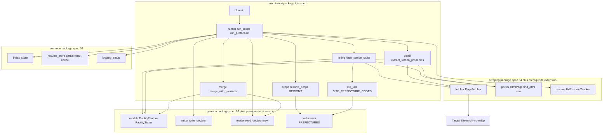
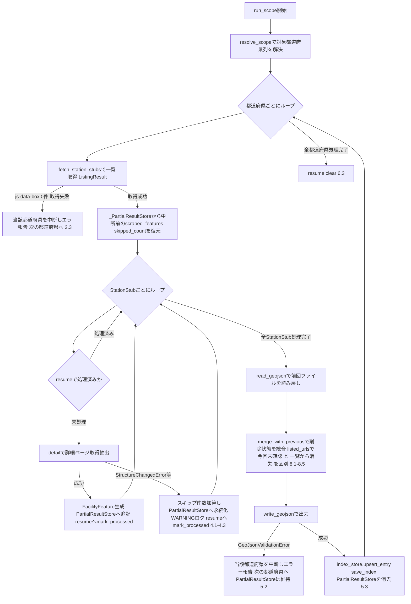
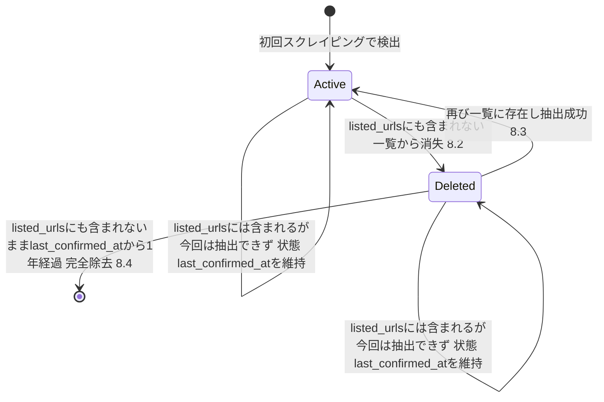

# Technical Design Document

## Overview

**Purpose**: 本機能は、全国の道の駅の位置情報・名称・付加情報を対象サイト(michi-no-eki.jp)からスクレイピングし、都道府県単位で分割したGeoJSONファイルとして`geo-json/`配下へ出力する、`roadstop-scraper`の中核バッチ処理を提供する。

**Users**: 運用者が全国・地方・都道府県単位でスクレイピングを実行するために利用する。最終的には道の駅アプリ等の消費側が、単一スキーマのGeoJSONデータセットを利用する。

**Impact**: 新規パッケージ`src/roadstop_scraper/michinoeki/`を追加し、実装完了済みの`02-common-infra`・`04-scraping-engine`が提供する取得・レジューム・レート制限・ロギング基盤と、`03-geojson-schema`が提供するGeoJSON出力スキーマ・検証・書き込み基盤を利用する。`03`・`04`には後方互換な追加型拡張(新規フィールド・新規メソッドの追加のみ、既存契約は変更しない)を行う。

### Goals

- 対象サイトから道の駅の一覧・詳細情報を取得し、都道府県単位で分割したGeoJSONファイルへ出力する
- 全国・地方(8区分)・都道府県のいずれかの単位でスクレイピング対象範囲を指定できるようにする
- 個々の道の駅の抽出失敗を都道府県全体・実行全体に波及させず、スキップして処理を継続する
- 対象サイトの一覧から消失した道の駅を即座に削除せず、削除状態(削除フラグ・最終確認日時)を伴って保持し、1年経過後に完全除去する
- 中断・再開(レジューム)・リクエスト頻度制御・共通ロギングを、`02-common-infra`・`04-scraping-engine`の既存機構にそのまま乗せる

### Non-Goals

- `06-sapa-scraping`(SA/PA)のスクレイピング実装
- `04-scraping-engine`のHTTP取得・HTMLパース機構そのものの再実装(本specは追加メソッド1件のみを依頼し、内部実装には立ち入らない)
- `03-geojson-schema`の検証・書き込みゲートウェイそのものの再実装(本specは追加フィールド・読み戻し関数のみを依頼する)
- サイト内都道府県コード↔公式都道府県コード対応表・8地方区分対応表の`03-geojson-schema`への共通化(06実装時の重複が判明した時点で再検討するYAGNI判断。research.md「Design Decisions」参照)
- 対象サイト以外の道の駅データソース(国土交通省一覧等)との突合・代替収集

## Boundary Commitments

### This Spec Owns

- 対象サイト(michi-no-eki.jp)固有の一覧ページ・詳細ページのURL構築・HTML抽出ロジック
- 実行対象範囲(全国・地方8区分・都道府県)の指定を解釈し、処理対象の都道府県列へ解決するロジックと、8地方区分↔公式都道府県コードの対応表
- サイト内都道府県コード↔公式都道府県コードの対応表(URL構築専用、対象サイト固有の実装詳細)
- 抽出結果の`FacilityProperties`へのマッピング(住所/郵便番号分離・駐車場台数の解析・施設設備タグの取得等)
- 前回出力GeoJSONとのマージによる削除状態(`status`・`last_confirmed_at`)の遷移ロジックと1年経過後の完全除去判定
- 都道府県単位・範囲単位のオーケストレーション(レジューム連携・個別道の駅の失敗スキップ・GeoJSON出力・`index.json`更新・ロギング)
- 都道府県単位の部分抽出結果キャッシュ(`_PartialResultStore`、中断・再開をまたいだ抽出結果自体の保持。`02-common-infra`の`ResumeStore`を内部実装として利用するが、キャッシュの意味付け・ライフサイクル管理は本specが所有する)
- 実行エントリポイント(範囲指定引数の受け付け)

### Out of Boundary

- HTTP取得のレート制限・リトライ・タイムアウト・エンコーディング解決の内部実装(`04-scraping-engine`の`PageFetcher`が所有。本specは呼び出すのみ)
- HTML解析の内部実装・bs4の隠蔽(`04-scraping-engine`の`HtmlPage`/`parser.py`が所有。本specは`bs4`を直接importしない)
- GeoJSONのFeature構造・座標系・命名規則・出力前検証・書き込みの内部実装(`03-geojson-schema`の`geojson`パッケージが所有。本specは`write_geojson`等の公開APIを呼ぶのみ)
- `geo-json/index.json`の読み込み・更新・保存の内部実装(`02-common-infra`の`index_store`が所有)
- レジューム永続化・レート制御の内部実装(`02-common-infra`が所有。`04-scraping-engine`経由で利用)
- `06-sapa-scraping`のスクレイピングロジック

### Allowed Dependencies

- `roadstop_scraper.scraping`: `PageFetcher`・`HtmlPage`(本specの依頼で追加される`find_attrs`を含む)・`FieldSpec`/`extract_record`・`UrlResumeTracker`・例外階層(`04-scraping-engine`)
- `roadstop_scraper.geojson`: `FacilityFeature`/`FacilityProperties`/`Coordinate`/`Parking`/`FacilityStatus`(本specの依頼で追加)・`prefectures`・`naming`・`writer.write_geojson`・`reader.read_geojson`(本specの依頼で新設、`03-geojson-schema`)
- `roadstop_scraper.common`: `index_store`(`upsert_entry`/`save_index`/`load_index`)・`logging_setup`・`resume_store.ResumeStore`(都道府県単位の部分抽出結果キャッシュ用に`runner`が直接利用。用途は「中断・再開をまたいだ抽出結果の保持」であり、`scraping.resume.UrlResumeTracker`が担う「URLを再取得すべきか」の判定とは別関心事)(`02-common-infra`)
- `python_util.time_utility`: `last_confirmed_at`・`index.json`の`updated_at`の時刻源として統一使用
- 依存方向の制約: `michinoeki/` → `geojson/` → `scraping/` → `common/`の一方向。逆方向のimportは行わない

### Prerequisite Extensions to Upstream Specs

本specの実装は、以下2件の**後方互換な追加型拡張**を前提とする。いずれも既存の公開契約(シグネチャ・型)を変更せず、新規フィールド・新規メソッドの追加のみであるため、`03`・`04`のRevalidation Triggers(シグネチャ変更等)には該当しない。追加後の保守責務は完全に`03`・`04`側へ戻り、本specはその公開APIの利用者に留まる(共有所有権を残さない)。

1. **`04-scraping-engine`**: `scraping/parser.py`の`HtmlPage`に`find_attrs(selector: str, attribute: str) -> list[str | None]`を追加する(`find_texts`の属性版)。一覧ページの`js-data-box`要素群から`data-name`/`data-link`/`data-lat`/`data-lng`を相関抽出するために必要(research.md「`HtmlPage`の属性抽出APIの過不足確認」参照)
2. **`03-geojson-schema`**: `geojson/models.py`の`FacilityProperties`に`status: FacilityStatus = FacilityStatus.ACTIVE`・`last_confirmed_at: datetime | None = None`を追加し、`FacilityStatus`(`StrEnum`: `ACTIVE`/`DELETED`)を新設する。あわせて`geojson/reader.py`(新規)に`read_geojson(path: Path) -> list[FacilityFeature]`を追加する(既存GeoJSONの読み戻し)。`geojson/validation.py`に`status`の列挙値検証を追加する

### Revalidation Triggers

- サイト内都道府県コード↔公式都道府県コードの対応表がサイト側の変更で不整合になった場合(URL構築の前提が崩れる)
- 一覧ページの`js-data-box`マークアップ(`data-name`/`data-link`/`data-lat`/`data-lng`)・詳細ページの`.info dl`ラベル構成・`.viewFacility`のDOM構造が変化した場合
- `FacilityProperties.status`/`last_confirmed_at`のフィールド名・型・`read_geojson`のシグネチャ変更(将来`06-sapa-scraping`が同機能を必要とする場合の共通化検討を含む)
- `UrlResumeTracker`のキー設計・`ResumeStore`の状態形状の変更
- 削除保持期間(1年)の変更

## Architecture

### Existing Architecture Analysis

`02-common-infra`・`03-geojson-schema`・`04-scraping-engine`が確立したパターンに従う:

- 不変データは`@dataclass(frozen=True)`、更新は新インスタンス生成
- APIはモジュールレベル関数+`__all__`、エラーは`ValueError`(または`04`の`ScrapingEngineError`)サブクラスの独自例外
- `geojson/`・`scraping/`と同様、`michinoeki/`も`__init__.py`で公開APIを集約し、利用側(エントリポイント)は`roadstop_scraper.michinoeki`のみをimportする
- `python_util.logging`経由の共通ロギング、`python_util.time_utility`によるJST時刻生成(`02-common-infra`の`index_store`更新と同じ時刻源)

### Architecture Pattern & Boundary Map



**Architecture Integration**:

- Selected pattern: `02`/`03`/`04`と同格の「spec単位サブパッケージ」として`michinoeki/`を新設し、内部を「参照データ(scope・site_urls)→収集(listing・detail)→統合(merge)→オーケストレーション(runner)→エントリポイント(cli)」の層状構成とする
- Domain/feature boundaries: サイト固有の収集ロジックと範囲指定・削除状態管理を本specが持ち、HTTP取得・HTMLパース・GeoJSON検証・書き込み・レジューム永続化・index.json管理はすべて既存パッケージへ委譲する
- **Dependency direction**: `scope`/`site_urls`(参照データ、依存なし) → `listing`/`detail`(`scraping`・`geojson.models`を利用) → `merge`(`geojson.reader`を利用) → `runner`(全モジュールを統合) → `cli`。各モジュールは自分より左のモジュールと`geojson/`・`scraping/`・`common/`・標準ライブラリのみimportできる
- Steering compliance: `python_util.logging`・`python_util.time_utility`の再利用、依存追加なし(新規サードパーティ依存を導入しない)、tech.mdのテスト命名・コメント方針に準拠

### Technology Stack

| Layer | Choice / Version | Role in Feature | Notes |
|-------|------------------|------------------|-------|
| CLI / Entrypoint | 標準ライブラリ`argparse` | 範囲指定引数(`--region`/`--prefecture-code`)の解釈 | 新規依存なし。プロジェクト初のエントリポイント。`pyproject.toml`の`[project.scripts]`に登録 |
| データ取得・パース | `roadstop_scraper.scraping`(`04`、追加メソッド含む) | HTTP取得・レート制限・HTML抽出 | 変更なく利用。`find_attrs`のみ追加を依頼 |
| データ永続化 | `roadstop_scraper.geojson`(`03`、追加フィールド・追加関数含む) | GeoJSON検証・書き込み・読み戻し | `status`/`last_confirmed_at`・`read_geojson`のみ追加を依頼 |
| 共通基盤 | `roadstop_scraper.common`(`02`) | index.json管理・レジューム永続化・ロギング | 変更なく利用 |
| 時刻 | `python_util.time_utility` | `last_confirmed_at`・1年経過判定・`index.json`更新時刻の統一時刻源 | 既存(`02`が確立済み)を再利用 |

## File Structure Plan

### Directory Structure

```text
src/roadstop_scraper/michinoeki/
├── __init__.py       # 公開API集約(run_scope・ScopeSpec等。利用側はこのモジュールのみをimport)
├── scope.py          # ScopeSpec/resolve_scope/REGIONS(8地方区分↔公式都道府県コード)/InvalidScopeError
├── site_urls.py      # SITE_PREFECTURE_CODES(サイト内コード↔公式コード)・build_search_url/build_detail_url
├── listing.py        # StationStub/ListingResult/fetch_station_stubs(一覧ページのjs-data-boxから名称・詳細URL・座標を抽出)
├── detail.py         # extract_station_properties(詳細ページのdt/dd・施設設備liからFacilityPropertiesを構築)
├── merge.py           # MergeResult/merge_with_previous(前回GeoJSONとのマージ・削除状態遷移・1年保持)
├── runner.py          # PrefectureRunResult/run_prefecture/run_scope/_PartialResultStore(オーケストレーション・部分結果キャッシュ)
└── cli.py             # main(argv)(エントリポイント)

tests/michinoeki/       # 上記と同構成のテスト(日本語ベースのテスト関数名)
```

### Modified Files

- `src/roadstop_scraper/geojson/models.py` — `FacilityStatus`(`StrEnum`)新設、`FacilityProperties`に`status`・`last_confirmed_at`追加、`_properties_to_dict`のシリアライズ対応、`from_feature_collection_dict`(読み戻し変換)追加
- `src/roadstop_scraper/geojson/validation.py` — `status`の列挙値検証を`_check_enums`相当へ追加
- `src/roadstop_scraper/geojson/reader.py`(新規) — `read_geojson(path: Path) -> list[FacilityFeature]`
- `src/roadstop_scraper/scraping/parser.py` — `HtmlPage.find_attrs(selector: str, attribute: str) -> list[str | None]`追加
- `pyproject.toml` — `[project.scripts]`に`michinoeki-scrape = "roadstop_scraper.michinoeki.cli:main"`を追加

## System Flows

### 都道府県単位の実行フロー



- 個々の道の駅の失敗(J)は、成功(I)と同様に`resume.mark_processed`を呼ぶ。構造変化や取得失敗は再試行しても解消しない可能性が高く、同一の中断・再開サイクル内で同じ道の駅に対する無駄な再試行を避けるための設計判断(次回の完全な範囲実行では resume が P でクリアされるため、再スクレイピングの機会は失われない)
- I・Jはいずれも`_PartialResultStore`への永続化を伴う(D2で読み込んだ内容に追記する形)。都道府県処理が完了しM/Oまで到達して初めて`_PartialResultStore`を消去するため、都道府県処理の途中で中断されても、再実行時にD2で中断前の`scraped_features`・`skipped_count`を失わずに再開できる(6.1、6.2の「無駄な再取得を避ける」が、実際にはその分のデータも保持することで意味を持つ)
- `listed_urls`(D由来)には、`scraped_features`に含まれる道の駅(I)だけでなく、レジュームでスキップされた(G「処理済み」)道の駅・座標欠落でスキップされた道の駅・detail抽出に失敗した道の駅(J)も含まれる。これらは一覧には実在するため、Lの`merge_with_previous`はこれらを「一覧から消失した」として`DELETED`へ遷移させず、前回状態のまま`features`へ引き継ぐ(詳細は「削除状態の遷移」参照)
- 都道府県単位の失敗(E・N)はその都道府県の処理のみを中断し、実行全体は継続する(2.3、5.2)。この場合、当該都道府県のresume状態・`_PartialResultStore`はいずれも完了扱いにならず、次回再開時に再試行される

### 削除状態の遷移(merge_with_previous)



- マージのキーは`FacilityProperties.source_url`(詳細ページURL、サイトの永続的なID相当)を用いる。名称は表記揺れ・改称の可能性があるため識別子として使わない
- `listed_urls`(`listing.ListingResult.listed_urls`)は、今回の一覧取得で存在が確認できた道の駅のURL集合であり、`scraped_features`(抽出まで成功した集合)より広い。両者の差分(`listed_urls`には含まれるが`scraped_features`には無いURL)は「一覧には実在するが今回は詳細抽出・レジューム都合で確認しきれなかった」ことを意味し、削除判定(Deleted遷移・1年経過判定)の対象から除外する。この区別がなければ、一時的な抽出失敗が繰り返し起きた実在施設が、誤って1年後に完全除去されてしまう

## Requirements Traceability

| Requirement | Summary | Components | Interfaces | Flows |
|-------------|---------|------------|------------|-------|
| 1.1–1.4 | 実行対象範囲(全国/地方/都道府県)の指定 | scope | `ScopeSpec`, `resolve_scope`, `REGIONS`, `InvalidScopeError` | — |
| 2.1–2.3 | 道の駅一覧の収集・一覧取得失敗時の都道府県単位中断 | listing, site_urls | `fetch_station_stubs`, `build_search_url` | 都道府県単位の実行フロー D, E |
| 3.1–3.4 | 詳細情報抽出・座標解釈失敗の扱い | detail, listing | `extract_station_properties`, `StationStub.coordinate` | 都道府県単位の実行フロー H |
| 4.1–4.3 | 個々の道の駅の抽出失敗時のスキップ・継続 | runner, listing | `run_prefecture`(内部の例外捕捉)、`ListingResult.skipped_count` | 都道府県単位の実行フロー D, H–J |
| 5.1–5.3 | 都道府県単位のGeoJSON出力・index.json更新 | runner, geojson.writer, common.index_store | `write_geojson`, `upsert_entry`, `save_index` | 都道府県単位の実行フロー K–O |
| 6.1–6.3 | レジューム(中断・再開) | runner, scraping.resume, common.resume_store | `UrlResumeTracker.is_processed/mark_processed/clear`、`_PartialResultStore`(runner内部) | 都道府県単位の実行フロー D2, G, I, J, P |
| 7.1 | リクエスト頻度制御 | listing, detail(PageFetcher経由) | `PageFetcher.fetch_text` | — |
| 8.1–8.5 | 廃止された道の駅の削除状態管理 | merge, geojson.reader, listing | `merge_with_previous`, `read_geojson`, `FacilityStatus`, `ListingResult.listed_urls` | 削除状態の遷移 |
| 9.1–9.2 | 動作ログの記録 | runner(logging_setup経由) | `get_logger`, `log_scrape_started/finished/failed` | 都道府県単位の実行フロー(各ステップ) |

## Components and Interfaces

| Component | Domain/Layer | Intent | Req Coverage | Key Dependencies (P0/P1) | Contracts |
|-----------|--------------|--------|--------------|--------------------------|-----------|
| scope | 参照データ・範囲解決 | 実行対象範囲を都道府県列へ解決する | 1.1–1.4 | geojson.prefectures (P0) | Service |
| site_urls | 参照データ・URL構築 | サイト内都道府県コードとの対応・URL構築 | 2.1 | geojson.prefectures (P0) | Service |
| listing | 収集 | 一覧ページから名称・詳細URL・座標を抽出する | 2.1–2.3, 3.1(座標), 7.1 | scraping.PageFetcher (P0), scraping.HtmlPage.find_attrs (P0), site_urls (P0) | Service |
| detail | 収集・マッピング | 詳細ページから付加情報を抽出しFacilityPropertiesへ変換する | 3.1–3.4, 7.1 | scraping.PageFetcher (P0), scraping.HtmlPage (P0), geojson.models (P0) | Service |
| merge | 統合 | 前回出力との差分から削除状態を遷移させる | 8.1–8.5 | geojson.reader (P0), geojson.models (P0) | Service |
| runner | オーケストレーション | 都道府県単位・範囲単位の一連の処理を統合する | 4.1–4.3, 5.1–5.3, 6.1–6.3, 9.1–9.2 | scope (P0), listing (P0), detail (P0), merge (P0), geojson.writer (P0), scraping.resume (P0), common.index_store (P0), common.logging_setup (P1) | Service, Batch |
| cli | エントリポイント | 範囲指定引数を受け付け`runner`を起動する | 1.1–1.4 | runner (P0) | Service |

### 参照データ・範囲解決層

#### scope

| Field | Detail |
|-------|--------|
| Intent | 運用者が指定する実行対象範囲(全国・地方8区分・都道府県)を、処理対象の`Prefecture`列へ解決する |
| Requirements | 1.1, 1.2, 1.3, 1.4 |

**Responsibilities & Constraints**

- 8地方区分(`hokkaido`/`tohoku`/`kanto`/`chubu`/`kinki`/`chugoku`/`shikoku`/`kyushu_okinawa`)と公式都道府県コードの対応表`REGIONS`を保持する。合計47都道府県を過不足なくカバーする
- `region`・`prefecture_code`のいずれも指定しない場合は全47都道府県を返す(1.1)。両方同時に指定された場合・値が対応表に存在しない場合は例外を送出する(1.4)

**Dependencies**

- Outbound: `geojson.prefectures.find_prefecture`/`PREFECTURES` — コードから`Prefecture`を解決 (P0)

**Contracts**: Service [x]

##### Service Interface

```python
@dataclass(frozen=True)
class ScopeSpec:
    region: str | None = None
    prefecture_code: str | None = None

class InvalidScopeError(ValueError):
    """regionとprefecture_codeが同時指定された場合、または値が対応表に存在しない場合に送出される。"""

REGIONS: Mapping[str, tuple[str, ...]]
"""地方区分名 -> 所属する都道府県コード列(公式コード)。8区分・47件で過不足なし。"""

def resolve_scope(spec: ScopeSpec) -> tuple[Prefecture, ...]:
    """ScopeSpecから処理対象のPrefecture列を解決する。両方省略時は全47都道府県。"""
```

- Preconditions: なし
- Postconditions: 戻り値は重複のない`Prefecture`列。全国指定時は`geojson.prefectures.PREFECTURES`と同一集合
- Invariants: `REGIONS`の全区分の合計は47都道府県と一致し、重複を持たない

#### site_urls

| Field | Detail |
|-------|--------|
| Intent | 対象サイト固有の都道府県コード(公式コードとは異なる独自番号体系)を保持し、一覧ページURLを構築する |
| Requirements | 2.1 |

**Responsibilities & Constraints**

- サイト内コード↔公式コードの47件対応表`SITE_PREFECTURE_CODES`を保持する(research.md「サイト内都道府県コードと公式都道府県コードの対応調査」参照)。対応表は本モジュールが唯一の正
- 詳細ページURL(`/stations/views/{id}`)は一覧ページの`data-link`から得られるため、本モジュールは一覧ページURLの構築のみを担う

**Dependencies**

- Outbound: `geojson.prefectures.Prefecture` — 公式コードの型 (P0)

**Contracts**: Service [x]

##### Service Interface

```python
BASE_URL = "https://www.michi-no-eki.jp"
SITE_PREFECTURE_CODES: Mapping[str, str]
"""公式都道府県コード("01"〜"47") -> サイト内都道府県コード("10"〜"56")。47件。"""

def build_search_url(prefecture: Prefecture) -> str:
    """一覧/検索ページの絶対URL(f"{BASE_URL}/stations/search/{サイト内コード}/all/all")を返す。"""
```

- Preconditions: `prefecture`は`geojson.prefectures.PREFECTURES`に含まれる47件のいずれか
- Postconditions: 戻り値は常に有効な絶対URL
- Invariants: `SITE_PREFECTURE_CODES`は47件・重複なし・`PREFECTURES`の全コードをカバーする

### 収集層

#### listing

| Field | Detail |
|-------|--------|
| Intent | 一覧/検索ページを取得し、都道府県内の全道の駅の名称・詳細URL・座標を抽出する |
| Requirements | 2.1, 2.2, 2.3, 3.1(座標), 7.1 |

**Responsibilities & Constraints**

- `div.js-data-box`要素群の`data-name`/`data-link`/`data-lat`/`data-lng`を`HtmlPage.find_attrs`で相関抽出する(research.md「一覧/検索ページの構造実測」参照)。ページネーションは辿らない(1ページ目に該当都道府県の全件が埋め込まれているため)
- 該当要素が0件の場合、一覧取得failureとして`ListingUnavailableError`を送出する(2.3)。個々の`js-data-box`で`data-name`/`data-link`は取得できるが`data-lat`/`data-lng`が欠落・数値変換不能な場合は、その1件のみを`StationStub`化せずスキップし、警告ログを記録して処理を継続する(4.1に準じる個別要素レベルの欠落耐性)
- スキップされた要素も`data-link`が取得できている限り、それは「一覧に実在するが座標のみ解釈できなかった」ことを意味する。この事実を呼び出し側(`merge`)が誤って「一覧から消失した」と判定しないよう、`data-link`が取得できた全要素(`StationStub`化できたか否かを問わない)の集合を`listed_urls`として戻り値に含める(8.1〜8.2、詳細は「削除状態の遷移」参照)
- スキップ件数は呼び出し側`runner`が都道府県単位のスキップ件数(4.3)に合算できるよう、戻り値に含めて返す(内部でカウントするのみで例外は伝播させない)
- HTTP取得は`scraping.PageFetcher`を経由するため、レート制限(7.1)は自動的に適用される

**Dependencies**

- Outbound: `scraping.PageFetcher.fetch_text` — ページ取得 (P0)
- Outbound: `scraping.parser.parse_html`/`HtmlPage.find_attrs` — 属性抽出(本specの依頼で追加) (P0)
- Outbound: `site_urls.build_search_url` — URL構築 (P0)
- Outbound: `geojson.models.Coordinate` — 座標型 (P1)

**Contracts**: Service [x]

##### Service Interface

```python
@dataclass(frozen=True)
class StationStub:
    name: str
    detail_url: str
    coordinate: Coordinate

@dataclass(frozen=True)
class ListingResult:
    stubs: tuple[StationStub, ...]
    listed_urls: frozenset[str]
    skipped_count: int

class ListingUnavailableError(ScrapingEngineError):
    """一覧ページからjs-data-box要素が1件も取得できなかった場合に送出される。"""

def fetch_station_stubs(fetcher: PageFetcher, prefecture: Prefecture) -> ListingResult:
    """都道府県の一覧ページを取得し、道の駅ごとのListingResultを返す。"""
```

- Preconditions: なし
- Postconditions: `stubs`は`data-name`/`data-link`/`data-lat`/`data-lng`がすべて解釈できた要素のみを含む。`listed_urls`は`data-name`/`data-link`が解釈できた全要素の`data-link`集合(`stubs`化できなかった座標欠落要素の`data-link`も含む)。`skipped_count`は座標欠落・数値変換不能によりスキップされた要素数
- Invariants: 個々の要素の座標欠落は例外を伝播させず、`skipped_count`への計上と`listed_urls`への含有のみで処理を継続する

**Implementation Notes**

- Integration: `find_attrs`の戻り値配列は同一DOM順序であることを前提に、4種の属性値をインデックスで対応付ける(research.md「Design Decisions」参照)
- Risks: `js-data-box`のマークアップ変更は本モジュールの構造変化として現れる。将来的な検知手段の強化は改訂時に検討する

#### detail

| Field | Detail |
|-------|--------|
| Intent | 詳細ページを取得し、名称以外の付加情報を抽出して`FacilityProperties`へ変換する |
| Requirements | 3.1(名称・付加情報)、3.2、3.3、3.4、7.1 |

**Responsibilities & Constraints**

- 名称は`.info dl:nth-of-type(1) dd`を`HtmlPage.require_text`で必須取得する(欠落時は`StructureChangedError`、4.1へつながる)
- 所在地・TEL・駐車場・営業時間・ホームページ・ホームページ2・マップコードは、`.info dl dt`/`.info dl dd`を`find_texts`で取得しラベル文字列をキーとした辞書へ変換したうえで参照する(位置に依存せず、要素数の変動(ホームページ2の有無)に頑健。research.md参照)
- 所在地は正規表現`^(\d{3}-\d{4})\s*(.*)$`で郵便番号と住所に分離する
- 駐車場は`大型：(\d+)台`・`普通車：(\d+)`・`身障者用(\d+)`をそれぞれ独立に`re.search`し、一致した項目のみ`Parking`へ設定する(表記揺れ「うち身障者用」を吸収)
- 施設設備は`.viewFacility li:not(.off) span`の全テキストを`find_texts`で取得し、`facilities`タプルへそのまま設定する(サイトが日本語ラベルを直接保持するため、番号→ラベルの対応表を持つ必要がない)
- ホームページ・ホームページ2は、値が空文字の場合(サイトが1件のみの施設にも空のホームページ2 dt/ddを出力するため)は`websites`から除外する
- 座標は本モジュールでは抽出しない(`listing.StationStub.coordinate`を呼び出し側から受け取る。research.md「座標の取得元を一覧ページのjs-data-boxに一本化する」参照)

**Dependencies**

- Outbound: `scraping.PageFetcher.fetch_text` — 詳細ページ取得 (P0)
- Outbound: `scraping.parser.parse_html`/`HtmlPage.find_texts`/`require_text` — 抽出 (P0)
- Outbound: `geojson.models.FacilityProperties`/`Parking`/`FacilityKind` — マッピング先の型 (P0)

**Contracts**: Service [x]

##### Service Interface

```python
def extract_station_properties(
    page: HtmlPage,
    prefecture: Prefecture,
    coordinate_source_url: str,
) -> FacilityProperties:
    """詳細ページから道の駅のFacilityPropertiesを構築する。

    名称が取得できない場合はStructureChangedErrorを送出する。
    座標は含まない(呼び出し側がCoordinateと合成しFacilityFeatureを構築する)。
    """
```

- Preconditions: `page`は詳細ページの`fetch_text`結果を`parse_html`した`HtmlPage`
- Postconditions: `kind=FacilityKind.MICHINOEKI`・`pref_code`/`pref_name`は`prefecture`から設定・`source_url`は`page.url`
- Invariants: 名称以外の全項目は欠落時`None`または空タプルとなり、例外を送出しない

**Implementation Notes**

- Integration: `runner`が本関数の戻り値と`listing.StationStub.coordinate`を組み合わせて`FacilityFeature`を構築する
- Validation: 駐車場・所在地の正規表現が一致しない場合は当該項目のみ`None`とし、他の項目の抽出は継続する
- Risks: 駐車場の表記揺れが調査した4件を超えるパターンを持つ可能性がある(research.md「Risks & Mitigations」参照)

### 統合層

#### merge

| Field | Detail |
|-------|--------|
| Intent | 前回出力のGeoJSONと今回のスクレイピング結果を統合し、削除状態(`status`・`last_confirmed_at`)を遷移させる |
| Requirements | 8.1, 8.2, 8.3, 8.4, 8.5 |

**Responsibilities & Constraints**

- 今回結果に含まれる道の駅(`source_url`で対応付け)は`status=ACTIVE`・`last_confirmed_at=confirmed_at`に更新する(8.1、8.3)
- 前回存在し今回結果に無い道の駅のうち、**`listed_urls`にも含まれないもの**(=一覧からも消失している)のみを`status=DELETED`へ遷移させ、`last_confirmed_at`は前回値を保持する(8.2)
- 前回存在し今回結果に無い道の駅のうち、**`listed_urls`には含まれるもの**(=一覧には実在するが、今回は詳細抽出失敗・座標欠落・レジューム中断によりスキップされ`scraped_features`に含められなかったもの)は、`status`・`last_confirmed_at`を一切変更せず前回の値のまま`features`へ引き継ぐ。「一覧から消失した」という削除判定の前提(8.2)を満たさない以上、今回スクレイピングできなかったことをもって削除状態へ遷移させてはならない(「今回は確認不能」であり「消失」ではない)
- `status=DELETED`かつ`confirmed_at - last_confirmed_at`が1年を超える道の駅は結果から除外する(8.4)
- 都道府県を指定した部分実行では、当該都道府県の前回ファイルのみを読み戻し対象とするため、削除判定は自然に指定範囲内の道の駅に限定される(8.5。`runner`が都道府県ごとに`merge_with_previous`を呼ぶ設計上、追加のフィルタリングは不要)

**Dependencies**

- Outbound: `geojson.reader.read_geojson`(本specの依頼で追加) — 前回ファイルの読み戻し (P0)
- Outbound: `geojson.models.FacilityFeature`/`FacilityStatus` — 型 (P0)

**Contracts**: Service [x]

##### Service Interface

```python
@dataclass(frozen=True)
class MergeResult:
    features: tuple[FacilityFeature, ...]
    reactivated_count: int
    newly_deleted_count: int
    purged_count: int

def merge_with_previous(
    previous_features: Sequence[FacilityFeature],
    scraped_features: Sequence[FacilityFeature],
    listed_urls: frozenset[str],
    confirmed_at: datetime,
    retention: timedelta = timedelta(days=365),
) -> MergeResult:
    """前回出力と今回スクレイピング結果をsource_urlで対応付けてマージする。

    listed_urlsは今回の一覧取得で存在が確認できた全道の駅のdetail_url集合
    (listing.ListingResult.listed_urls、詳細抽出の成否を問わない)。
    previous_featuresのうちscraped_featuresに含まれないものは、listed_urls
    に含まれるか否かで「今回確認できなかっただけ(現状維持)」と
    「一覧から消失した(削除状態へ遷移)」を区別する。
    """
```

- Preconditions: `scraped_features`は`status=ACTIVE`・`last_confirmed_at=None`の状態で渡される(まだ確認日時が設定されていない今回分)。`listed_urls`は`scraped_features`の全`source_url`を包含する(一覧に無い道の駅が`scraped_features`に入ることはない)
- Postconditions: 戻り値の`features`はすべて「`last_confirmed_at`が今回更新されたACTIVE」「前回値を維持したACTIVE/DELETED(今回確認不能)」「1年未経過のDELETED」のいずれか
- Invariants: `retention`を超えたDELETEDの道の駅は`features`に含まれない(完全除去)。`listed_urls`に含まれる道の駅が新たに`DELETED`へ遷移することはない

**Implementation Notes**

- Integration: `previous_features`が空(初回実行・前回ファイル未存在)の場合は今回結果をそのまま`ACTIVE`として返す
- Integration: `runner`は`listing.fetch_station_stubs`が返す`ListingResult.listed_urls`をそのまま本関数へ渡す。レジューム中断によりスキップされた道の駅(`scraping.resume`で処理済み扱いだが今回`scraped_features`に含められなかったもの)も、一覧には実在するため`listed_urls`に含まれ、削除判定の対象外として正しく扱われる
- Risks: `source_url`が対象サイト側で変わることがあれば同一施設が別施設として扱われる。research.mdのRevalidation Triggersに記録済み

### オーケストレーション層

#### runner

| Field | Detail |
|-------|--------|
| Intent | 都道府県単位・範囲単位の一連の処理(一覧取得・詳細抽出・マージ・出力・index更新・レジューム・ロギング)を統合する |
| Requirements | 4.1, 4.2, 4.3, 5.1, 5.2, 5.3, 6.1, 6.2, 6.3, 9.1, 9.2 |

**Responsibilities & Constraints**

- `UrlResumeTracker`のキーは範囲(全国/地方/都道府県)によらず単一の`"michinoeki"`とする。既に処理済みのURLは範囲をまたいで再取得しない
- 個々の道の駅の抽出失敗(`ScrapingEngineError`系)は、成功時と同様に`resume.mark_processed`を呼んだうえでスキップ件数を加算し、処理を継続する(構造変化等は再試行しても解消しない可能性が高く、同一の中断・再開サイクル内での無駄な再試行を避けるため。次回の完全実行ではresumeがクリアされるため再スクレイピングの機会は失われない)
- 一覧取得失敗(`ListingUnavailableError`)・出力前検証違反(`GeoJsonValidationError`)は当該都道府県の処理のみを中断し、範囲全体の処理は継続する。この場合、当該都道府県のURLはresumeで完了扱いにせず、次回再開時に再試行させる
- 指定範囲の全都道府県が(個別の道の駅スキップを許容しつつ)処理完了した場合にのみ、`resume.clear()`を呼ぶ
- 開始・終了・都道府県別件数・スキップ件数・削除状態遷移件数を`common.logging_setup`のヘルパーおよび`logger.info`/`logger.warning`で記録する
- **都道府県単位の部分抽出結果の永続化**: `UrlResumeTracker`はURL単位の処理済みフラグのみを永続化し、抽出済みの`FacilityProperties`そのものは保持しない。そのため、都道府県の処理途中で中断された場合、`resume.is_processed`で再取得をスキップした道の駅は今回実行のメモリ上には存在せず、これを対策しないまま最終`write_geojson`を都道府県ループ完了後に1回だけ実行すると、中断前に成功していた道の駅が出力から欠落する(最悪の場合、前回ファイルにあれば`merge`が誤って削除方向へ倒す)。これを防ぐため、`runner`は都道府県ごとに`common.resume_store.ResumeStore`を直接利用する内部専用の部分結果キャッシュ(`_PartialResultStore`、キー例: `f"michinoeki-partial-{prefecture.code}"`)を持ち、道の駅1件の処理(成功時は`FacilityFeature`、失敗時はスキップとしてカウント)が確定するたびに逐次追記・永続化する。都道府県処理の開始時にこのキャッシュを読み込んで`scraped_features`・`skipped_count`の初期値として復元し、`write_geojson`・`index_store`更新が正常完了した後にのみキャッシュを消去する(消去前にプロセスが中断されても、次回起動時に同じキャッシュから正しく再開できる)
- このキャッシュは`geojson`パッケージのスキーマ知識に依存しない`michinoeki`内部専用の実装詳細であり、`__init__.py`の公開APIには含めない。消費側アプリ向けの正規表現である`geo-json/`配下の出力とは独立している

**Dependencies**

- Inbound: `cli.main` — 起動 (P0)
- Outbound: `scope.resolve_scope` (P0), `listing.fetch_station_stubs` (P0), `detail.extract_station_properties` (P0), `merge.merge_with_previous` (P0), `geojson.writer.write_geojson` (P0), `geojson.reader.read_geojson` (P0), `geojson.naming.build_geojson_filename` (P0), `scraping.resume.UrlResumeTracker` (P0), `common.index_store.upsert_entry/save_index/load_index` (P0), `common.resume_store.ResumeStore`(部分抽出結果キャッシュ用、`UrlResumeTracker`とは別インスタンス) (P0), `common.logging_setup.get_logger`/`log_scrape_started`/`log_scrape_finished`/`log_scrape_failed` (P1)

**Contracts**: Service [x] / Batch [x]

##### Service Interface

```python
@dataclass(frozen=True)
class PrefectureRunResult:
    prefecture: Prefecture
    scraped_count: int
    skipped_count: int
    reactivated_count: int
    newly_deleted_count: int
    purged_count: int

def run_prefecture(
    prefecture: Prefecture,
    *,
    fetcher: PageFetcher,
    resume: UrlResumeTracker,
    confirmed_at: datetime,
) -> PrefectureRunResult | None:
    """1都道府県分のパイプラインを実行する。

    都道府県専用の部分結果キャッシュ(_PartialResultStore)を読み込んで
    中断前の抽出結果・スキップ件数を復元したうえで、未処理の道の駅のみを
    処理する。一覧取得・出力検証の失敗時はNoneを返し、resumeもキャッシュも
    完了扱いにしない(次回再開時にキャッシュから続行できる)。
    """

def run_scope(spec: ScopeSpec) -> list[PrefectureRunResult | None]:
    """resolve_scopeで得た都道府県を順に処理する。

    一覧取得・出力検証の失敗で中断した都道府県はNoneのまま結果列に含め、
    呼び出し側が失敗都道府県を判別できるようにする。全都道府県が
    Noneでない場合にのみresumeをclearする。
    """
```

##### Batch / Job Contract

- Trigger: `cli.main`から起動、または直接`run_scope`を呼び出す
- Input / validation: `ScopeSpec`(`scope.resolve_scope`が範囲の妥当性を検証する)
- Output / destination: `geo-json/{都道府県コード}_{ローマ字名}_michinoeki.geojson`・`geo-json/index.json`の更新
- Idempotency & recovery: 同一都道府県の再実行は`merge_with_previous`により冪等(前回状態を引き継いだうえでの差分更新)。中断時は`UrlResumeTracker`により未処理の道の駅・都道府県から再開し、`_PartialResultStore`により中断前に成功していた抽出結果も失われず再開できる

**Implementation Notes**

- Integration: `write_geojson`が送出する`GeoJsonValidationError`は本モジュールが捕捉し、ERRORログへ変換したうえで当該都道府県をスキップする(仕様上、`detail`が正しく実装されていれば通常発生しない防御的経路)。この場合`_PartialResultStore`は消去しない(次回再開時に同じ部分結果から続行するため)
- Integration: `_PartialResultStore`は`FacilityFeature`をJSONシリアライズ可能な辞書へ変換して`ResumeStore.save`へ渡す(`geojson.to_feature_collection_dict`が内部で使う変換とは独立した`michinoeki`専用の最小実装で構わない。消費側フォーマットとの整合は不要)
- Risks: `_PartialResultStore`のキー(`prefecture.code`)と`UrlResumeTracker`の処理済みURL集合が不整合になる異常系(例: 手動でのファイル削除)は、次回全件再実行(resume.clear後)で自然に解消される

### エントリポイント

#### cli

| Field | Detail |
|-------|--------|
| Intent | 運用者からの範囲指定引数を受け付け、`runner.run_scope`を起動する |
| Requirements | 1.1, 1.2, 1.3, 1.4 |

**Responsibilities & Constraints**

- `argparse`で`--region {8区分のいずれか}`・`--prefecture-code {01〜47}`を相互排他の任意引数として受け付ける(両方省略時は全国、両方指定時はエラー)
- `scope.InvalidScopeError`を捕捉し、標準エラー出力へメッセージを表示して非ゼロの終了コードを返す(1.4)。この場合`run_scope`は呼び出さない

**Dependencies**

- Outbound: `scope.ScopeSpec`/`InvalidScopeError` (P0), `runner.run_scope` (P0)

**Contracts**: Service [x]

##### Service Interface

```python
def main(argv: Sequence[str] | None = None) -> int:
    """コマンドライン引数を解釈しrun_scopeを実行する。正常終了0、範囲指定エラー時は非ゼロを返す。"""
```

- Preconditions: なし
- Postconditions: 戻り値は`sys.exit`にそのまま渡せる終了コード
- Invariants: 範囲解決に失敗した場合、いかなるHTTPリクエストも発生しない(1.4)

## Data Models

### Domain Model

- 集約: `FacilityFeature`(既存、`03-geojson-schema`所有)。本specは`FacilityProperties`に`status`・`last_confirmed_at`を追加するのみで、集約構造自体は変更しない
- 値オブジェクト: `StationStub`(一覧ページの中間表現、`michinoeki`所有)・`ScopeSpec`・`MergeResult`・`PrefectureRunResult`(いずれも`michinoeki`所有、`geojson`のスキーマには属さない)
- 不変条件: `status=DELETED`かつ保持期間超過の道の駅は出力GeoJSONに存在できない(mergeが強制)

### Data Contracts & Integration

`03-geojson-schema`への追加プロパティ(既存スキーマへの後方互換な追加):

| JSONキー | 型 | 必須 | 出力条件 |
|----------|----|------|----------|
| status | `"active"` \| `"deleted"` | — | `ACTIVE`(既定)の場合はキー省略、`DELETED`の場合のみ出力 |
| last_confirmed_at | string(ISO 8601) | — | 値がある場合は常に出力 |

サイト内都道府県コード対応表(`site_urls.SITE_PREFECTURE_CODES`、抜粋。全47件はSupporting References参照):

| 公式コード | サイト内コード | 都道府県名 |
|---|---|---|
| 01 | 10 | 北海道 |
| 02 | 11 | 青森県 |
| … | … | … |
| 47 | 56 | 沖縄県 |

8地方区分対応表(`scope.REGIONS`、公式コード範囲で表記):

| 区分キー | 都道府県コード範囲 |
|---|---|
| hokkaido | 01 |
| tohoku | 02–07 |
| kanto | 08–14 |
| chubu | 15–23 |
| kinki | 24–30 |
| chugoku | 31–35 |
| shikoku | 36–39 |
| kyushu_okinawa | 40–47 |

## Error Handling

### Error Strategy

既存の例外階層(`04`の`ScrapingEngineError`系、`03`の`GeoJsonValidationError`)にそのまま乗り、本specは新規に以下の例外のみを追加する。すべて「範囲(都道府県・実行全体)ごとの継続可否」を呼び出し側(`runner`)が判断できるよう、原因を明確に区別する。

- `scope.InvalidScopeError` — 範囲指定自体が不正(実行前に確定、HTTPリクエスト発生前)
- `listing.ListingUnavailableError` — 一覧取得失敗(`ScrapingEngineError`のサブタイプ、当該都道府県のみ中断)

### Error Categories and Responses

- **範囲指定不正(1.4)**: `cli`が`InvalidScopeError`を捕捉しエラーメッセージ表示・非ゼロ終了。スクレイピングは一切開始しない
- **一覧取得失敗(2.3)**: `runner`が`ListingUnavailableError`をERRORログ化し、当該都道府県のresumeを未完了のまま次の都道府県へ継続する
- **個々の道の駅の抽出失敗(4.1–4.3)**: `runner`が`ScrapingEngineError`系(`FetchFailedError`/`ContentParseError`/`StructureChangedError`)をWARNINGログ化してスキップし、resumeを完了扱いにしたうえで次の道の駅へ継続する
- **出力前検証違反(5.2)**: `runner`が`GeoJsonValidationError`をERRORログ化(違反件数・要約)し、当該都道府県のresumeを未完了のまま次の都道府県へ継続する

### Monitoring

- 開始・終了は`log_scrape_started`/`log_scrape_finished`(範囲全体・都道府県ごと)で記録する
- スキップ件数・削除状態遷移件数(新規削除・再出現・完全除去)は`PrefectureRunResult`/実行サマリとして`logger.info`で記録する(9.1)
- エラー発生時は対象URL・都道府県・エラー内容を`logger.warning`/`logger.error`に含める(9.2)。`log_scrape_failed`は範囲全体が例外で異常終了する場合(想定外のバグ等)にのみ用いる

## Testing Strategy

### Unit Tests

- scope: `resolve_scope`が引数省略時に全47都道府県を返すこと、地方指定時に該当都道府県のみを返すこと、未知の地方・都道府県コードで`InvalidScopeError`となること、`region`と`prefecture_code`同時指定で`InvalidScopeError`となること(1.1–1.4)
- site_urls: `SITE_PREFECTURE_CODES`が47件・重複なしで`PREFECTURES`の全コードをカバーすること、`build_search_url`が正しい絶対URLを生成すること
- listing: フィクスチャHTMLから`js-data-box`4属性を正しく相関抽出できること、要素0件で`ListingUnavailableError`となること、一部要素の座標欠落時にその1件のみ`stubs`から除外され`skipped_count`に計上されつつ`listed_urls`には含まれること(2.1–2.3, 3.4)
- detail: フィクスチャHTMLから名称必須取得・所在地の郵便番号分離・駐車場の3パターン(標準/「うち」表記/身障者用なし)・施設設備タグ・ホームページ0/1/2件の各ケースを正しく抽出できること、名称欠落時に`StructureChangedError`となること(3.1–3.4)
- merge: 初回実行(前回なし)で全件ACTIVEとなること、`listed_urls`にも含まれず消失した道の駅がDELETEDへ遷移すること、DELETED後に再出現しACTIVEへ戻ること、1年経過したDELETEDが完全除去されること、1年未経過のDELETEDは保持されること、**`listed_urls`には含まれるが`scraped_features`には無い道の駅(今回detail抽出のみ失敗)が、ACTIVE/DELETEDいずれの前回状態でも変化せず維持されること**(8.1–8.5)

### Integration Tests

- runner: フィクスチャHTML+偽`PageFetcher`セッションで、1都道府県分の一覧取得→詳細抽出→マージ→`write_geojson`→`index_store`更新までが一貫して動作すること(5.1–5.3)
- runner: 一部道の駅の詳細抽出が`StructureChangedError`となっても、当該都道府県の他の道の駅・他都道府県の処理が継続されること(4.1–4.3)。この際、抽出失敗した道の駅が前回ファイルにACTIVEとして存在していた場合、DELETEDへ遷移しないこと(8.2との誤混同防止)
- runner+resume: 中断を模した状態(一部URLを処理済みとして`ResumeStore`に保存)から再実行した場合、処理済みURLがスキップされ、未処理のみ取得されること。全都道府県完了後に`resume.clear`が呼ばれ状態が消えること(6.1–6.3)
- runner+resume: **都道府県処理の途中(`_PartialResultStore`への永続化後・`write_geojson`到達前)を模して中断し再実行した場合、中断前に抽出成功していた道の駅が最終`write_geojson`の出力に含まれること、中断前後のスキップ件数が合算されて`PrefectureRunResult.skipped_count`に反映されること、`write_geojson`成功後に`_PartialResultStore`が消去され次回実行に影響しないこと**(6.1–6.3、5.1、4.3)
- runner: 一覧取得失敗・出力前検証違反それぞれで、当該都道府県のみ中断され他都道府県の処理が継続されること。出力前検証違反時は`_PartialResultStore`が消去されず次回再開できること(2.3, 5.2)

### E2E(手動・実装後の確認)

- 対象サイトの実際の一覧・詳細ページへの実アクセスで、1都道府県分の収集からGeoJSON出力・`index.json`更新までが成立すること(CIでは実行しない。サーバ負荷への配慮からフィクスチャベースを基本とする。`04-scraping-engine`と同方針)

## Supporting References

### サイト内都道府県コード対応表(全47件)

`site_urls.SITE_PREFECTURE_CODES`の全件(公式コード: サイト内コード): `01:10, 02:11, 03:13, 04:14, 05:12, 06:15, 07:16, 08:17, 09:18, 10:19, 11:20, 12:21, 13:22, 14:23, 15:24, 16:25, 17:26, 18:27, 19:28, 20:29, 21:30, 22:31, 23:32, 24:33, 25:34, 26:35, 27:36, 28:37, 29:38, 30:39, 31:40, 32:41, 33:42, 34:43, 35:44, 36:45, 37:46, 38:47, 39:48, 40:49, 41:50, 42:51, 43:52, 44:53, 45:54, 46:55, 47:56`

(出典: research.md「サイト内都道府県コードと公式都道府県コードの対応調査」。実装時はこの対応をテーブルとして`site_urls.py`に定義する)
