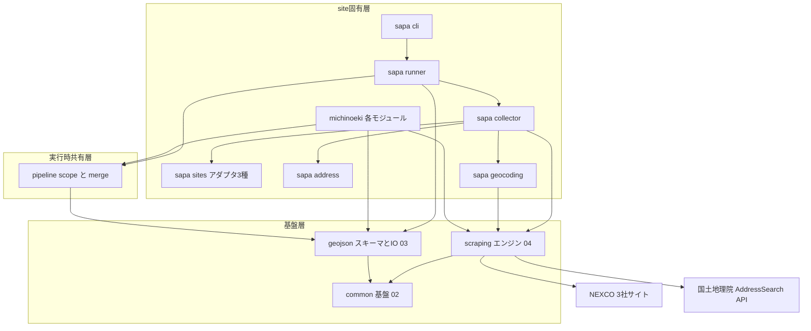
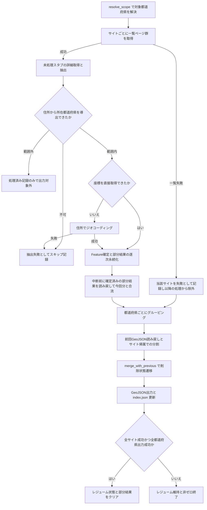

# Technical Design Document: 06-sapa-scraping

## Overview

**Purpose**: 本機能は、全国の高速道路SA/PAの位置情報・名称・付加情報をNEXCO 3社の公式SA/PAサイトから収集し、都道府県単位のGeoJSONファイルとして`geo-json/`へ出力する。道の駅(05)と同一スキーマでSA/PAデータを提供することで、消費側アプリケーションが両施設種別を単一の形式で扱えるようにする。

**Users**: 運用者はCLI(`sapa-scrape`)で全国・地方・都道府県単位のバッチ収集を実行する。道の駅アプリ等の消費側は出力されたGeoJSONと`index.json`を参照する。

**Impact**: 既存の`michinoeki/`パッケージと対称な`sapa/`パッケージを新設する。あわせて、05と完全同一仕様である実行範囲解決(`scope`)と削除状態遷移(`merge`)を共有層`pipeline/`へ移設し、05側はimport置換で追従する(二重管理の解消)。座標がサイトに掲載されないため、住所からのジオコーディング(国土地理院 AddressSearch API)を座標取得の主経路として新規統合する。

### Goals

- NEXCO東日本(driveplaza.com)・中日本(sapa.c-nexco.co.jp)・西日本(w-holdings.co.jp)の3サイトから全国のSA/PAを収集する
- 路線名・上り/下り区分・方面を含むSA/PA固有情報を既存スキーマ(`FacilityProperties`)へマッピングする
- 座標を直接取得できない施設を住所ベースのジオコーディングで補完し、データセットの網羅性を確保する
- 05と同等の運用特性(範囲指定・レジューム・レート制限・削除状態管理・共通ログ)を提供する

### Non-Goals

- NEXCO 3社の管轄外の休憩施設(JB本四高速・都市高速・地方道路公社等)の収集(将来のサイトアダプタ追加で対応可能な構造にはする)
- SAとPAの種別区別のスキーマ化(`FacilityKind.SAPA`単一。名称で判別可能)
- GeoJSONスキーマの拡張(補完由来フラグ等は追加しない)
- 道の駅スクレイピング(05)の機能変更(`pipeline/`移設に伴うimport置換のみ)
- スクレイピング結果の手動編集・上書き手段

## Boundary Commitments

### This Spec Owns

- `sapa/`パッケージ全体: サイトアダプタ(3サイトの一覧・詳細抽出)、住所→都道府県導出、ジオコーディング、収集ループ、都道府県グルーピングとマージ・出力のオーケストレーション、CLI
- 新設する共有層`pipeline/`パッケージの創設と、`michinoeki/`からの`scope.py`・`merge.py`の無変更移設(および05側のimport・テスト配置の追従修正)
- `geo-json/*_sapa.geojson`ファイルの内容と、`index.json`の当該エントリ
- 国土地理院 AddressSearch APIとの統合契約(`GsiGeocoder`)

### Out of Boundary

- HTTP取得・HTMLパース・リトライ・構造変化検知の共通機構(`scraping/`=04が所有。本specは利用のみ)
- GeoJSONのFeature構造・検証・読み書き・命名・都道府県参照データ(`geojson/`=03が所有。本specは利用のみ)
- レート制限・レジューム永続化・`index.json`機構・共通ロギングの実装(`common/`=02が所有)
- `pipeline/scope`・`pipeline/merge`のロジック変更(移設は無変更。仕様変更が必要になった場合は05との整合を含む別途の変更管理)
- `geo-json/*_michinoeki.geojson`の内容(05が所有)

### Allowed Dependencies

- `sapa/` → `pipeline/`・`scraping/`・`geojson/`・`common/`・`python_util`(logging・time_utility)
- `pipeline/` → `geojson/`のみ(実行時関心の共有層。`scraping/`・site固有パッケージへは依存しない)
- `michinoeki/` → `pipeline/`(移設後のimport置換。`sapa/`⇔`michinoeki/`間の直接依存は禁止)
- 外部: NEXCO 3社サイト(HTML取得)、国土地理院 AddressSearch API(JSON取得)。いずれも`scraping.PageFetcher`経由でのみアクセスする(レート制限・リトライの一元適用)

### Revalidation Triggers

- `pipeline/`のモジュール構成・公開シグネチャの変更 → 05の再検証が必要(移設自体が05のimport修正を伴うため、本spec実装時に05のテストスイート全通過を検証タスクで保証する)
- `FacilityProperties`のJSONキー・必須項目の変更(03側変更) → 本specの出力・読み戻しの再検証
- `ScrapingConfig`のキー・既定値の変更(04側変更) → レート制限適用(8.1)の再検証
- サイトアダプタの`source_url`形式変更 → マージキー・レジュームキーの互換性喪失につながるため、削除状態管理(R9)の再検証

## Architecture

### Existing Architecture Analysis

現行は「site固有パッケージ(`michinoeki/`) → 共通層(`scraping/`・`geojson/`・`common/`)」の一方向依存で、site固有パッケージは URL構成 → 一覧 → 詳細 → マージ → runner → cli の層構成を持つ。本specはこの構成を踏襲するが、次の2点が05と構造的に異なる:

1. **情報源が3サイト**: 一覧・詳細のHTML構造とURL形式がサイトごとに異なるため、サイトアダプタ(`SapaSite`プロトコル)で差異を吸収し、収集ループ・座標解決・マージは共通化する
2. **一覧が都道府県単位ではない**(道路・エリア単位): 都道府県は詳細ページの住所から導出し、収集(サイト横断)→ 都道府県グルーピング → マージ・出力、という後段グルーピング型のフローになる(05は都道府県単位の前段ループ型)

### Architecture Pattern & Boundary Map



**Architecture Integration**:
- Selected pattern: サイトアダプタ+共通収集ループ(research.md「Architecture Pattern Evaluation」参照。サイト別独立3スクレイパ案・単一サイト案は却下)
- Domain/feature boundaries: サイト固有知識(URL構成・セレクタ・表記正規化)は`sapa/sites/`の各アダプタに閉じ込める。収集ループ(`collector`)とオーケストレーション(`runner`)はアダプタのプロトコルのみに依存する
- Existing patterns preserved: 一方向依存、レジューム2層構造(URL単位+部分結果)、`source_url`マージキー、都道府県単位出力+`index.json`更新、終了コードによる失敗通知
- New components rationale: `pipeline/`は05と06の仕様重複(REGIONS・削除状態遷移)の単一管理のため。`geocoding`・`address`は座標非掲載サイトへの対応(R4)のため
- Steering compliance: requests+BeautifulSoup(04経由)・`python_util.logging`・pdm・成果物の`geo-json/`分離を維持

### Technology Stack

| Layer | Choice / Version | Role in Feature | Notes |
|-------|------------------|-----------------|-------|
| CLI | argparse(標準ライブラリ) | `sapa-scrape`エントリポイント | 05の`michinoeki-scrape`と同形式 |
| 収集 | `scraping.PageFetcher`(requests) / `parse_html`(BeautifulSoup) | サイトHTML取得・パース | 04の公開APIのみ使用。新規依存なし |
| ジオコーディング | 国土地理院 AddressSearch API | 住所→座標の補完(4.2) | `PageFetcher.fetch_json`で取得。認証不要・追加ライブラリなし。出典表示をREADMEへ記載 |
| データ/永続化 | `geojson/`・`common/`(既存) | GeoJSON出力・index.json・レジューム | 変更なし |
| 共有ロジック | `pipeline/`(新設) | 範囲解決・削除状態遷移 | `michinoeki/`から無変更移設 |

## File Structure Plan

### Directory Structure

```text
src/roadstop_scraper/
├── pipeline/                  # 新設: 05/06共有の実行時ロジック層
│   ├── __init__.py            # 公開API(ScopeSpec, REGIONS, resolve_scope, InvalidScopeError, MergeResult, merge_with_previous)
│   ├── scope.py               # michinoeki/scope.py から無変更移設
│   └── merge.py               # michinoeki/merge.py から移設(docstringの道の駅前提記述のみ一般化)
├── sapa/                      # 新設: SA/PAスクレイピング本体
│   ├── __init__.py            # パッケージ公開API(run_scope, main 等)
│   ├── sites/
│   │   ├── __init__.py        # SapaSiteプロトコル・SapaStub/SapaListingResult/SapaDetail型・上下線/名称正規化ヘルパ・ALL_SITES登録
│   │   ├── east.py            # NEXCO東日本(driveplaza.com)アダプタ
│   │   ├── central.py         # NEXCO中日本(sapa.c-nexco.co.jp)アダプタ
│   │   └── west.py            # NEXCO西日本(w-holdings.co.jp)アダプタ
│   ├── address.py             # 郵便番号分離・住所→Prefecture導出(3.6)
│   ├── geocoding.py           # GsiGeocoder(4.1-4.3)
│   ├── collector.py           # collect_site収集ループ・SapaPartialStore・SiteListingError(2, 3, 4, 5, 7)
│   ├── runner.py              # run_scope・都道府県グルーピング・マージ・出力・index更新(1, 6, 9, 10)
│   └── cli.py                 # sapa-scrapeエントリポイント(1)
tests/
├── pipeline/                  # tests/michinoeki/ からscope・merge関連テストを移設
└── sapa/                      # 新規テスト(sites/address/geocoding/collector/runner/cli)
```

### Modified Files

- `src/roadstop_scraper/michinoeki/runner.py` — `scope`・`merge`のimportを`pipeline`へ置換(ロジック変更なし)
- `src/roadstop_scraper/michinoeki/cli.py` — `scope`のimportを`pipeline`へ置換
- `src/roadstop_scraper/michinoeki/scope.py`・`merge.py` — 削除(pipeline/へ移設)
- `src/roadstop_scraper/michinoeki/__init__.py` — 公開APIの再export元を`pipeline`へ追従(既存の公開名は維持)
- `tests/michinoeki/`のscope・merge関連テスト — `tests/pipeline/`へ移設(import修正のみ)
- `pyproject.toml` — `[project.scripts]`へ`sapa-scrape = "roadstop_scraper.sapa.cli:main"`を追加
- `README.md` — sapa-scrapeの使い方・国土地理院ジオコーディングの出典表示を追記

## System Flows



フロー上の主要な判断:

- **サイト失敗の隔離**(2.3×9.2の両立): 一覧取得に失敗したサイトは実行から除外するが、マージ時に前回GeoJSONの各施設を`source_url`のホスト名で管轄サイトへ帰属させ、失敗サイト帰属の施設は削除判定から外して現状維持で出力する。これにより1サイトの障害が「当該サイト全施設の一斉削除遷移」を引き起こさない(research.md Design Decisions参照)
- **範囲外施設の扱い**: 一覧は道路・エリア単位のため範囲外都道府県の施設も詳細取得されうる。都道府県確定後に範囲外と判明した施設は処理済み記録のみ行い(同一実行内の再訪防止)、ジオコーディング・出力・スキップ集計の対象にしない
- **座標解決の順序**(4.1→4.2→4.3): サイト提供座標を優先し、無い場合のみジオコーディング。両方失敗で抽出失敗スキップ
- **レジュームのクリア条件**(7.3): 全サイトの一覧成功かつ範囲内全都道府県の出力成功、かつ部分結果キャッシュに今回の範囲外の都道府県帰属の復元施設が残っていない場合のみ。部分結果キャッシュ(`SapaPartialStore`)も同時にクリアする(より広い範囲の実行が中断した後、より狭い範囲で再開して全成功した場合に、範囲外都道府県の復元施設が出力されないままクリアで消失するのを防ぐ)

## Requirements Traceability

| Requirement | Summary | Components | Interfaces | Flows |
|-------------|---------|------------|------------|-------|
| 1.1-1.3 | 全国/地方/都道府県の範囲指定 | pipeline.scope, sapa.cli, sapa.runner | `ScopeSpec`, `resolve_scope` | フロー冒頭A |
| 1.4 | 不正範囲のエラー報告と実行拒否 | pipeline.scope, sapa.cli | `InvalidScopeError` | HTTP発生前に検証 |
| 2.1 | 対象範囲の都道府県に所在するSA/PA一覧取得(上下線含む) | sapa.sites, sapa.collector | `SapaSite.listing_urls`, `parse_listing` | フローB+範囲外除外G |
| 2.2 | 詳細ページ特定情報の取得 | sapa.sites | `SapaStub.detail_url` | フローB→D |
| 2.3 | 一覧失敗範囲の中断と他範囲の継続 | sapa.collector, sapa.runner | `SiteListingError` | フローC |
| 3.1 | 名称・路線名・緯度経度の抽出 | sapa.sites, sapa.collector | `SapaDetail` | フローD |
| 3.2 | 上り/下り区分の記録と上下線別データ化 | sapa.sites(正規化ヘルパ) | `SapaDetail.direction` | フローD |
| 3.3 | 任意項目(住所・電話・営業時間・駐車場・HP・方面)の抽出 | sapa.sites, sapa.address | `SapaDetail`, `split_postal_address` | フローD |
| 3.4 | 施設設備の文字列配列記録 | sapa.sites | `SapaDetail.facilities` | フローD |
| 3.5 | GeoJSONプロパティへの変換 | sapa.collector | `FacilityProperties`構築 | フローJ |
| 3.6 | 所在都道府県を特定できない場合の抽出失敗 | sapa.address, sapa.collector | `find_prefecture_by_address` | フローE→F |
| 4.1 | 直接取得できた座標の記録 | sapa.sites, sapa.collector | `SapaDetail.coordinate` | フローH |
| 4.2 | 住所からの座標補完 | sapa.geocoding | `GsiGeocoder.geocode` | フローI |
| 4.3 | 直接取得・補完とも不可なら抽出失敗 | sapa.collector | — | フローI→F |
| 4.4 | 補完実施の運用者向け記録 | sapa.geocoding, sapa.runner | INFOログ+件数集計 | フローI, N後の集計ログ |
| 5.1 | 必須項目欠落時のスキップと警告ログ | sapa.collector | WARNINGログ(URL含む) | フローF |
| 5.2 | スキップ後の処理継続 | sapa.collector | — | フローF→D |
| 5.3 | 都道府県単位のスキップ件数記録 | sapa.collector, sapa.runner | `skipped_counts`(都道府県別+不明バケット) | フローN後の集計ログ |
| 6.1 | 都道府県・種別対応の命名でのGeoJSON出力 | sapa.runner | `build_geojson_filename`+`FacilityKind.SAPA` | フローN |
| 6.2 | 検証違反時の当該都道府県出力中断と報告 | sapa.runner | `GeoJsonValidationError`捕捉 | フローN |
| 6.3 | 出力成功時のindex.json更新 | sapa.runner | `index_store` | フローN |
| 7.1 | 再実行時の処理済みスキップ | sapa.collector | `UrlResumeTracker("sapa")` | フローD |
| 7.2 | 施設処理完了時の処理済み記録 | sapa.collector | `mark_processed`(部分結果保存後) | フローJ |
| 7.3 | 正常完了時のレジュームクリア | sapa.runner | `resume.clear`+`SapaPartialStore.clear` | フローP |
| 8.1 | 全HTTPリクエストへの最小間隔適用 | scraping.PageFetcher(既存) | `ScrapingConfig.min_interval` | サイト用・ジオコーディング用の両フェッチャーに適用 |
| 9.1 | 一覧存在確認時の最終確認日時更新 | pipeline.merge | `merge_with_previous`(confirmed_at) | フローM |
| 9.2 | 一覧消失施設の削除状態付与と出力継続 | pipeline.merge, sapa.runner | `listed_urls`+サイト帰属分割 | フローL→M |
| 9.3 | 再出現時の削除状態解除 | pipeline.merge | `reactivated_count` | フローM |
| 9.4 | 1年経過後の完全除去 | pipeline.merge | `retention=365日` | フローM |
| 9.5 | 部分実行時の削除判定の範囲限定 | sapa.runner | 範囲内都道府県のファイルのみ読み書き | フローK→N |
| 10.1 | 開始/完了・件数(取得/スキップ/補完/削除遷移)の記録 | sapa.runner, sapa.collector | `log_scrape_started/finished`+集計ログ | 全フロー |
| 10.2 | エラー時のURL・都道府県・内容のログ記録 | sapa.collector, sapa.runner | ERRORログ/WARNINGログ | フローC, F |

## Components and Interfaces

| Component | Domain/Layer | Intent | Req Coverage | Key Dependencies | Contracts |
|-----------|--------------|--------|--------------|------------------|-----------|
| pipeline.scope | 共有層 | 範囲指定→都道府県列の解決(移設) | 1.1-1.4 | geojson (P0) | Service |
| pipeline.merge | 共有層 | 前回出力との統合と削除状態遷移(移設) | 9.1-9.4 | geojson (P0) | Service |
| sapa.sites | site固有層 | 3サイトの一覧・詳細抽出の差異吸収 | 2.1-2.2, 3.1-3.4, 4.1 | scraping.HtmlPage (P0) | Service |
| sapa.address | site固有層 | 郵便番号分離・住所→都道府県導出 | 3.3, 3.6 | geojson.PREFECTURES (P0) | Service |
| sapa.geocoding | site固有層 | 住所→座標の補完 | 4.2-4.4, 8.1 | scraping.PageFetcher (P0), GSI API (External P1) | Service |
| sapa.collector | site固有層 | サイト単位の収集ループ・部分結果永続化 | 2.3, 3.5-3.6, 4.3, 5.1-5.3, 7.1-7.2 | sites/address/geocoding (P0), scraping (P0), common.ResumeStore (P0) | Service, State |
| sapa.runner | site固有層 | 範囲全体のオーケストレーション・マージ・出力 | 1.1-1.3, 2.3, 6.1-6.3, 7.3, 9.5, 10.1-10.2 | collector (P0), pipeline (P0), geojson (P0), common.index_store (P0) | Batch |
| sapa.cli | site固有層 | エントリポイントと終了コード | 1.1-1.4 | runner (P0), pipeline.scope (P0) | Service |

### 共有層(pipeline)

#### pipeline.scope / pipeline.merge

| Field | Detail |
|-------|--------|
| Intent | 05から無変更移設される範囲解決・削除状態遷移の共有実装 |
| Requirements | 1.1-1.4, 9.1-9.4 |

- 公開シグネチャは現行(`ScopeSpec`/`REGIONS`/`resolve_scope`/`InvalidScopeError`、`MergeResult`/`merge_with_previous(previous, scraped, listed_urls, confirmed_at, retention=365日)`)を維持する。ロジック変更は本specの境界外
- `merge_with_previous`は`source_url`をキーとするドメイン非依存実装であり、上下線別URL(東日本)・`sapainfoid`(中日本)等のSA/PA URLでもそのまま正しく動作する
- **Implementation Notes** — Integration: `michinoeki/`のimport置換と既存テストの`tests/pipeline/`への移設を同一タスクで行い、05のテストスイート全通過で移設の無害性を保証する。Risks: 移設漏れ(再export先の欠落)はimportエラーとして即時顕在化するため低リスク

### site固有層(sapa)

#### sapa.sites(SapaSiteプロトコルと3アダプタ)

| Field | Detail |
|-------|--------|
| Intent | サイトごとのURL構成・HTML構造・表記の差異を吸収し、共通型へ正規化する |
| Requirements | 2.1, 2.2, 3.1-3.4, 4.1 |

**Responsibilities & Constraints**
- 一覧URL列の構成(対象都道府県列→関連エリア・道路の一覧URL群)、一覧のパース(スタブ化)、詳細のパース(`SapaDetail`化)をサイトごとに実装する
- 上下線の正規化(「(上)」「(上り)」「上り方面」等→`Direction`)と名称からの方向表記除去は`sites/__init__.py`の共通ヘルパで行い、上下集約施設は`direction=None`とする(3.2)
- CSSセレクタ・URLテンプレートは各アダプタ内に閉じ込め、`collector`以降へ漏らさない
- HTTP取得は行わない(純粋なURL構成とパースのみ。取得は`collector`が`PageFetcher`で行う)

**Dependencies**
- Inbound: sapa.collector — 一覧・詳細のパース依頼 (P0)
- Outbound: scraping.HtmlPage — セレクタ抽出 (P0) / sapa.sites共通ヘルパ — 正規化 (P0)
- External: NEXCO 3社サイト — HTML構造への暗黙依存 (P1。構造変化は`StructureChangedError`で検知)

**Contracts**: Service [x]

##### Service Interface

```python
@dataclass(frozen=True)
class SapaStub:
    display_name: str          # 一覧上の表示名(方向表記を含みうる生値)
    detail_url: str            # 詳細ページ絶対URL。source_url・レジューム・マージのキー

@dataclass(frozen=True)
class SapaListingResult:
    stubs: tuple[SapaStub, ...]
    listed_urls: frozenset[str]  # 一覧で存在確認できた全detail_url(スタブ化失敗分も含む)
    skipped_count: int           # 一覧段階で解釈できずスキップした要素数

@dataclass(frozen=True)
class SapaDetail:
    name: str                        # 方向表記を除去した施設名
    road_name: str | None
    direction: Direction | None      # 正規化済み上り/下り。上下集約はNone
    area_direction: str | None       # 方面(例: 青森方面)
    address: str | None
    postal_code: str | None
    tel: str | None
    opening_hours: str | None
    parking: Parking | None
    websites: tuple[str, ...]
    facilities: tuple[str, ...]
    coordinate: Coordinate | None    # サイトが直接提供する場合のみ(4.1)。現3サイトは通常None

class SapaSite(Protocol):
    key: str            # "east" | "central" | "west"(レジューム・ログ・サイト帰属の識別子)
    listing_kind: Literal["html", "json"]  # 一覧の取得形式。collectorがfetch_text+parse_html/fetch_jsonのどちらを使うか判定する
    def owns_url(self, url: str) -> bool: ...          # source_urlのホスト名帰属判定(サイト失敗隔離用)
    def listing_urls(self, prefectures: Sequence[Prefecture]) -> tuple[str, ...]: ...
    def parse_listing(self, content: HtmlPage | object) -> SapaListingResult: ...  # listing_kindに応じてHtmlPageまたは生JSON値を受け取る
    def extract_detail(self, page: HtmlPage, detail_url: str) -> SapaDetail: ...

ALL_SITES: tuple[SapaSite, ...]  # east, central, west の登録順リスト
```

- Preconditions: `extract_detail`へ渡す`page`は当該サイトの詳細ページのパース結果であること
- Postconditions: `parse_listing`は1件もURLを確認できない場合に空の`listed_urls`を返す(失敗判定は`collector`が行う)。`extract_detail`は名称を取得できない場合`StructureChangedError`を送出する
- Invariants: `detail_url`は絶対URLかつ同一施設・同一方向で安定(マージキー要件)

**Implementation Notes**
- Integration: `listing_urls`は範囲の都道府県列から関連エリアのみを選択して過剰取得を抑える(エリア→都道府県の対応表はアダプタ内定数)。中日本の一覧はページネーションを辿る想定だったが、実装タスク3.2で実測した結果、ページネーションはJS駆動でURLベースの静的解析では再現できないことが判明したため、中日本アダプタは1ページ目(216件中20件)のみを返す既知の制約とした(タスク6.3での実サイト調査対象)
- Validation: 東日本のセレクタは実測済みの構造(詳細URL`/sapa/{道路}/{施設}/{1|2}/`・タイトル「施設名(上り線)・道路名」)を基準とし、中日本・西日本は実装タスク先頭の実測で確定した
- **既知の制限(タスク6.3の実サイト疎通確認で発見)**: 東日本の一覧URL構成は当初`arealist`(検索フォームの地域コード)値ごとに都道府県を割り当て、交差するエリアごとに個別のURLを構成する設計だったが、実サイトへのライブ検証で`arealist`は`HIGHWAY=AA`併用時に値によらず常に東日本管内全域(実測約875件)を返す(`arealist=0`と`arealist=1`のレスポンスが完全に一致)ことが判明した。都道府県単位の一覧フィルタは実サイト側に存在しない。この修正不能な制限を受け、`listing_urls`は東日本管内の都道府県が1件でも要求された場合、単一の全域一覧URL(`arealist=0`)のみを返すよう変更した(以前の複数URL構成は同一内容の重複取得に過ぎず、サードパーティサーバへの不要な負荷だった)。都道府県への絞り込みは一覧取得の時点では行わず、`sapa.collector`の詳細住所ベースの絞り込みに完全に委ねる(collector側の変更は不要)。東日本管内を対象とする実行は常に管内全域(~875件)の詳細取得を伴うこと自体は実サイトの構造上の制約であり、本アダプタでは解消できない
- **Protocol拡張(タスク3.3で実施)**: 西日本(w-holdings.co.jp)には一覧のサーバレンダリングHTMLが存在せず、実際の一覧データは`https://www.w-holdings.co.jp/sapa/json/map-search.json`(310件・緯度経度を含む)からJSで取得される構造であることが実測で判明した。`HtmlPage`/`parse_html`はJSONテキストからは構造化データを復元できないため(`HtmlPage.find_text("body")`が`None`を返すことを実測で確認)、`SapaSite`プロトコルへ`listing_kind`属性を追加し、`parse_listing`の引数型を`HtmlPage | object`へ拡張した。東日本・中日本アダプタへは`listing_kind = "html"`の1行追加のみを行い、既存のロジック・テストは無変更(非破壊)。西日本の直接座標(JSON側にのみ存在し`SapaStub`/`SapaListingResult`には運べない)は本タスクでは活用せず、常にジオコーディング(4.2)へフォールバックする(`SapaStub`のコード座標フィールド追加は将来のスキーマ見直し候補として先送り)
- Risks: 管轄境界施設の重複掲載の可能性(実測で確認し、判明時はALL_SITES順の先勝ちで重複排除を追加)

#### sapa.address

| Field | Detail |
|-------|--------|
| Intent | 住所文字列の郵便番号分離と所在都道府県の導出 |
| Requirements | 3.3, 3.6 |

**Contracts**: Service [x]

```python
def split_postal_address(raw: str) -> tuple[str | None, str]:
    """「〒349-0112 埼玉県蓮田市…」形式から(郵便番号, 住所本体)を分離する。〒・郵便番号が無い場合は(None, 原文)。"""

def find_prefecture_by_address(address: str) -> Prefecture | None:
    """住所本体の先頭を PREFECTURES の日本語名と前方一致させ Prefecture を返す。一致なしは None(呼び出し側で3.6の抽出失敗)。"""
```

- Invariants: 47都道府県名の前方一致は相互に衝突しない(純粋関数・HTTPなし)

#### sapa.geocoding

| Field | Detail |
|-------|--------|
| Intent | 国土地理院 AddressSearch APIによる住所→座標の補完 |
| Requirements | 4.2, 4.3, 4.4, 8.1 |

**Responsibilities & Constraints**
- 補完専用のフェッチャー(`PageFetcher`別インスタンス・同一`ScrapingConfig`)を用い、GSI APIへのリクエストにもサイトと同じ最小間隔・リトライを適用する(8.1)
- 補完成功時は施設URL・住所・得られた座標をINFOログへ記録する(4.4)

**Dependencies**
- External: 国土地理院 AddressSearch API(`https://msearch.gsi.go.jp/address-search/AddressSearch?q={住所}`) — 認証不要・GeoJSON Feature配列応答 (P1。恒久提供保証なし。research.md参照)

**Contracts**: Service [x]

##### Service Interface

```python
class GsiGeocoder:
    def __init__(self, fetcher: PageFetcher) -> None: ...
    def geocode(self, address: str) -> Coordinate | None:
        """住所を座標化する。候補なし・応答形式不正・取得失敗(ScrapingEngineError)はWARNINGログの上Noneを返し、例外は送出しない。"""
```

- Preconditions: `address`は空でない住所本体(郵便番号分離済み)
- Postconditions: 返る`Coordinate`はWGS84・経度緯度の有限値(応答の`geometry.coordinates`=[経度, 緯度]の第1候補)。非有限・欠落はNone扱い
- Invariants: 例外を漏らさない(補完失敗は4.3のスキップ判断として`collector`が扱う)

**Implementation Notes**
- Integration: `fetch_json`の応答は`object`型のため、構造検証(リスト・geometry.coordinates存在・数値性)を本モジュールで行う
- Risks: API提供停止時は本モジュールの差し替えで対応(プロトコル化はしない。現時点で実装は1つのため。synthesis: Simplification)

#### sapa.collector

| Field | Detail |
|-------|--------|
| Intent | 1サイト分の一覧→詳細→座標解決→Feature化の収集ループと部分結果の逐次永続化 |
| Requirements | 2.1-2.3, 3.1, 3.5, 3.6, 4.1, 4.3, 5.1-5.3, 7.1, 7.2 |

**Responsibilities & Constraints**
- 一覧はサイトの全一覧URLの取得成功を要求し、1ページでも失敗(`ScrapingEngineError`)または全体で`listed_urls`が空の場合は`SiteListingError`でサイト単位の失敗とする(2.3。空一覧を正常扱いすると9.2で一斉削除遷移が起こるため)
- 詳細ループ: 未処理スタブのみ取得(7.1)→`extract_detail`→必須項目検査(路線名`road_name`が欠落した施設は5.1のスキップ。名称欠落は`extract_detail`内の`StructureChangedError`で同じくスキップへ合流)→住所分離→都道府県導出(不可なら5.1のスキップ)→範囲外なら処理済み記録のみ→座標解決(4.1優先、無ければジオコーディング、両方不可でスキップ=4.3)→`FacilityProperties`構築(3.5。`kind=FacilityKind.SAPA`・`pref_code`/`pref_name`・`source_url=detail_url`)→部分結果保存→`mark_processed`(7.2。05と同じ「結果保存が先」の順序で中断時の取りこぼしを防ぐ)
- スキップは警告以上のログ(URL・都道府県・理由)と件数集計(都道府県別。都道府県導出前の失敗は「都道府県不明」バケット)で記録する(5.1, 5.3, 10.2)
- 個々の施設の失敗はサイト内・サイト間の処理を止めない(5.2)

**Dependencies**
- Inbound: sapa.runner — サイトごとの収集依頼 (P0)
- Outbound: sapa.sites (P0) / sapa.address (P0) / sapa.geocoding (P0) / scraping.PageFetcher・UrlResumeTracker (P0) / common.ResumeStore (P0)

**Contracts**: Service [x] / State [x]

##### Service Interface

```python
class SiteListingError(Exception):
    """サイトの一覧取得が完全には成功しなかった(当該サイトを実行から除外する)。site_keyと原因を保持する。"""

@dataclass(frozen=True)
class SiteCollectResult:
    site_key: str
    features: tuple[FacilityFeature, ...]      # 範囲内都道府県の成功結果
    listed_urls: frozenset[str]                # 当該サイトの一覧で存在確認できた全URL
    skipped_counts: Mapping[str, int]          # 都道府県コード(または"unknown")→スキップ件数
    geocoded_counts: Mapping[str, int]         # 都道府県コード→補完件数(4.4, 10.1)

def collect_site(
    site: SapaSite,
    scope_prefectures: Sequence[Prefecture],
    *,
    fetcher: PageFetcher,
    geocoder: GsiGeocoder,
    resume: UrlResumeTracker,
    partial_store: SapaPartialStore,
) -> SiteCollectResult:  # raises SiteListingError
```

##### State Management

- State model: `SapaPartialStore`(本モジュール内のクラス)が実行全体の部分結果(features・skipped_counts・geocoded_counts)を`common.ResumeStore`のキー`"sapa-partial"`へ逐次永続化する。`add_feature`は`source_url`で冪等
- Persistence & consistency: 05の`_PartialResultStore`と同じ「結果保存→mark_processed」順序・「正常完了時のみクリア」規律。構造が05と異なる(件数が都道府県別マップ)ため共通化せず専用実装とする(research.md Design Decisions参照)
- Concurrency strategy: 単一プロセス前提(既存パイプラインと同じ)

#### sapa.runner

| Field | Detail |
|-------|--------|
| Intent | 範囲全体のオーケストレーション(サイト横断収集→都道府県グルーピング→マージ→出力→集計ログ) |
| Requirements | 1.1-1.3, 2.3, 4.4, 5.3, 6.1-6.3, 7.3, 9.1-9.5, 10.1, 10.2 |

**Responsibilities & Constraints**
- `resolve_scope`で対象都道府県を解決(1.1-1.3。HTTP発生前。`InvalidScopeError`は伝播)し、`ALL_SITES`を順に`collect_site`へ渡す。`SiteListingError`はサイト失敗として記録し他サイトを継続する(2.3)
- 収集開始前に`SapaPartialStore`の保持内容(前回の中断実行までに確定済みの施設・件数)をスナップショットとして読み戻し、グルーピング時に今回分と合流させる(7.2の出力側。中断前に収集済み=`mark_processed`済みの施設は再開実行の`collect_site`に現れないため、読み戻しが無いと出力から欠落する)。同一`source_url`は今回の新結果を優先し、失敗サイト帰属の復元施設は合流させない(現状維持で合流する前回施設との二重出力を防ぐ。除外分はキャッシュに残り当該サイト成功時に合流)。成功サイト帰属だが今回の`listed_urls`に含まれない復元施設も合流させない(中断前に収集確定した施設が再開までの間に実際にサイトの一覧から消えていた場合、無条件で「今回確認済み」として復活させると9.2の削除判定を迂回してしまうため。除外分は前回出力があれば`merge_with_previous`自身の`listed_urls`判定に委ねられる)
- 成功サイトの結果を都道府県ごとにグルーピングし、範囲内の各都道府県について: 前回GeoJSON読み戻し→前回施設を`owns_url`でサイト帰属分割(失敗サイト帰属分は削除判定から除外し現状維持でそのまま出力へ合流)→成功サイト分を`merge_with_previous`(listed_urlsは成功サイトの和集合)でマージ(9.1-9.4)→`build_geojson_filename(pref, FacilityKind.SAPA)`で出力(6.1)→`index_store`更新(6.3)
- どのサイトにも帰属しない前回施設(アダプタ構成変更後の残存等)は通常の削除判定に含める
- 出力前検証違反(`GeoJsonValidationError`)・前回ファイル破損は当該都道府県のみ中断しERRORログで報告する(6.2、05と同じ隔離)
- 範囲内都道府県のファイルのみを読み書きするため、削除判定は自然に範囲へ限定される(9.5)
- 全サイト成功かつ全都道府県出力成功の場合のみ`resume.clear()`と`SapaPartialStore.clear()`を行う(7.3)
- 集計ログ: 実行開始/完了・都道府県ごとの取得/スキップ/補完/削除遷移(移行・解除・完全除去)件数(10.1)。エラーはURL・都道府県・内容付き(10.2)

**Dependencies**
- Inbound: sapa.cli (P0)
- Outbound: sapa.collector (P0) / pipeline.scope・merge (P0) / geojson(reader/writer/naming) (P0) / common.index_store (P0) / python_util.time_utility — confirmed_atの実行内単一スナップショット (P2)

**Contracts**: Batch [x]

##### Batch / Job Contract

- Trigger: `sapa.cli`(手動またはcron)。`run_scope(spec, *, fetcher=None, geocoder=None, resume=None, confirmed_at=None, output_dir=DEFAULT_OUTPUT_DIR, index_path=None, partial_result_store=None) -> SapaScopeRunResult`(省略時は既定構築。テスト用差し替え引数は05と同形式)
- Input / validation: `ScopeSpec`。不正値は`InvalidScopeError`(1.4)
- Output / destination: `geo-json/{都道府県2桁}_{ローマ字}_sapa.geojson`+`index.json`更新。戻り値`SapaScopeRunResult(prefecture_results, failed_site_keys, failed_prefecture_codes)`、`SapaPrefectureResult(prefecture, scraped_count, skipped_count, geocoded_count, reactivated_count, newly_deleted_count, purged_count)`
- Idempotency & recovery: レジューム2層(`UrlResumeTracker("sapa")`+`SapaPartialStore`)により中断・再開で同一結果へ収束(7.1-7.3)。マージは`source_url`キーで冪等

#### sapa.cli

| Field | Detail |
|-------|--------|
| Intent | `sapa-scrape`エントリポイント(引数解釈・終了コード) |
| Requirements | 1.1-1.4 |

- 05の`cli.py`と同形式: `--region`/`--prefecture-code`(検証は`resolve_scope`へ一本化し、HTTP発生前に`InvalidScopeError`を検出)。失敗サイトまたは失敗都道府県が1つでもあれば非ゼロ終了とし、stderrへ要約を出す(運用監視の終了コード検知)

## Data Models

### Domain Model

- 集約は既存の`FacilityFeature`(座標+`FacilityProperties`)をそのまま用いる。SA/PA固有値のマッピング: `kind=SAPA`、`road_name`=路線名、`direction`=正規化済み上り/下り(集約施設はNone)、`area_direction`=方面、`parking.standard`←サイト表記「小型」、`mapcode`=常にNone(道の駅固有)、`source_url`=詳細ページ絶対URL(同一性の唯一のキー)
- 上下線で別々の詳細URLを持つ施設は別Feature(3.2)。`source_url`が異なるためマージ・レジュームも自然に別管理になる
- 中間表現(`SapaStub`/`SapaListingResult`/`SapaDetail`)と部分結果の永続化構造(features+都道府県別件数マップ)はComponents節の定義のとおり。部分結果のfeatures直列化は既存`to_feature_collection_dict`/`from_feature_collection_dict`を再利用する

### Data Contracts & Integration

- 出力GeoJSON・`index.json`の契約は03定義のまま変更なし(消費側への影響なし)
- GSI AddressSearch応答(外部契約): `[{"geometry": {"coordinates": [経度, 緯度]}, "properties": {"title": ...}}, ...]`。第1候補のみ使用し、構造不一致はNone扱い(防御的パース)

## Error Handling

### Error Strategy

05と同じ「失敗単位の最小化と安全側への倒し込み」を踏襲し、失敗単位を4層で隔離する。

| 層 | トリガ | 対応 | 要件 |
|----|--------|------|------|
| 実行全体 | `InvalidScopeError` | HTTP発生前にstderr報告・終了コード1(スクレイピング開始しない) | 1.4 |
| サイト単位 | `SiteListingError`(一覧の取得失敗・空一覧) | 当該サイトを除外し他サイト継続。前回データはサイト帰属分割で現状維持(削除遷移させない) | 2.3, 9.2 |
| 都道府県単位 | `GeoJsonValidationError`・前回GeoJSON破損 | 当該都道府県の出力のみ中断・ERRORログ・他都道府県継続。レジューム/部分結果は維持 | 6.2 |
| 施設単位 | 必須項目欠落・都道府県導出不可・座標解決不可・`ScrapingEngineError` | スキップ+WARNINGログ(URL含む)+件数集計。`mark_processed`して同一サイクル内の再試行を避ける | 3.6, 4.3, 5.1-5.3 |

### Monitoring

- `python_util.logging`の共通ロガーで、開始/完了(`log_scrape_started/finished`)・都道府県別集計(取得・スキップ・補完・削除遷移)・失敗サイト一覧を記録する(10.1, 10.2)。出力先は`pyproject.toml`の`[tool.python_util.logging]`で制御(steering準拠)
- 終了コード: 全成功=0、それ以外=1(cron監視)

## Testing Strategy

### Unit Tests

- `sapa.address`: 「〒付き住所の郵便番号分離」「47都道府県名の前方一致導出」「都道府県名を含まない住所でNone」(3.3, 3.6)
- `sapa.sites`正規化ヘルパ: 「(上)/(上り)/上り方面の`Direction.UP`への正規化」「方向表記の名称からの除去」「集約施設のNone」(3.2)
- 各サイトアダプタ: フィクスチャHTMLでの一覧相関抽出(スタブ・listed_urls・スキップ件数)と詳細抽出(名称・路線名・駐車場「小型→standard」等)。名称欠落での`StructureChangedError`(2.1, 2.2, 3.1, 3.3, 3.4, 5.1)
- `sapa.geocoding`: `fetch_json`モックで「第1候補の座標化」「候補なしでNone」「取得失敗(`ScrapingEngineError`)でNone・例外非送出」「非有限座標の棄却」(4.2, 4.3)
- `pipeline.scope`・`pipeline.merge`: 05から移設した既存テストがそのまま回帰を担保(1.1-1.4, 9.1-9.4)

### Integration Tests

- `sapa.collector`: 「レジューム済みURLの詳細取得スキップ」(7.1)、「部分結果保存→mark_processedの順序と中断・再開での復元」(7.2)、「範囲外都道府県の施設が出力・集計に含まれない」(2.1)、「座標直接取得がある場合ジオコーディングを呼ばない」(4.1)、「一覧1ページ失敗での`SiteListingError`」(2.3)
- `sapa.runner`: 「1サイト失敗時に当該サイト帰属の前回施設が削除遷移せず維持され、他サイトは正常処理」(2.3×9.2)、「削除状態遷移・復帰・1年経過の完全除去」(9.1-9.4)、「都道府県指定時に範囲外ファイルへ触れない」(9.5)、「検証違反都道府県の隔離とindex.json非更新」(6.1-6.3)、「全成功時のみresume/部分結果クリア」(7.3)、「集計ログの件数整合」(10.1)
- `michinoeki`回帰: `pipeline/`移設後の05テストスイート全通過(移設の無害性)

### E2E Tests

- `sapa.cli`: 「不正な範囲指定でHTTPリクエストが発生せず終了コード1」(1.4)、「失敗サイトありで終了コード1」
- 実疎通(05のタスク7.5と同パターン): 各サイト1施設+GSI 1件の実リクエストでセレクタ・応答形式を検証する実装タスクを設ける(自動テストには含めない)

## Performance & Scalability

- 全国フルランの概算リクエスト数: 一覧数十+詳細約900(上下線別込み)+ジオコーディング最大約900 ≈ 2,000リクエスト。既定の最小間隔1秒で約35〜40分(バッチ用途として許容。8.1)
- ジオコーディングはサイト取得と別フェッチャー(別`RateLimiter`)のため、ホストごとの間隔が独立に保たれ、相互に過剰待機しない
- 範囲指定実行では、関連エリア外の一覧を取得しない・範囲外施設をジオコーディングしないことで過剰取得を抑える

## Security Considerations

- 対象はすべて公開ページ・公開APIで認証情報を扱わない。User-Agentは04既定(`DEFAULT_USER_AGENT`)を明示送出
- GSI APIの利用条件(過度な負荷の禁止・出典表示)に従い、レート制限適用とREADMEへの出典表示(「国土地理院」)を行う
- スクレイピング先3サイトへの負荷配慮はレート制限・レジューム(再取得回避)・範囲指定の組み合わせで担保(steeringの倫理方針準拠)
